## 1. Opis systemu

**Barney** to aplikacja webowa wspierająca osoby zarządzające zwierzętami w małych gospodarstwach, stajniach, zagrodach, schroniskach i prywatnych hodowlach. System centralizuje w jednym miejscu informacje, które w takich miejscach najczęściej są rozproszone po notatkach, arkuszach kalkulacyjnych, wiadomościach i kalendarzach: ewidencję zwierząt, ich lokalizacje, stan zdrowia oraz zadania i przypomnienia związane z opieką.

Główne cele systemu:

- prowadzenie ewidencji zwierząt wraz z gatunkiem, płcią, stanem zdrowia i lokalizacją,
- zarządzanie lokalizacjami (stajnia, boks, zagroda, wybieg) i przypisywanie do nich zwierząt,
- planowanie i kontrola zadań zdrowotnych (HEALTH) oraz zarządczych (MANAGEMENT),
- śledzenie terminów zadań — wyróżnianie zadań nadchodzących i zaległych,
- dodawanie przypomnień do zadań,
- prowadzenie historii notatek dla zwierząt i lokalizacji (z datą i autorem),
- rozdzielenie uprawnień między właściciela, pracownika i administratora.

Kontekst użycia: aplikacja działa w przeglądarce, na komputerze lub telefonie, po zalogowaniu. Przeznaczona jest dla małego użytkownika obsługującego od kilku do kilkunastu zwierząt, a nie dla profesjonalnego, produkcyjnego gospodarstwa.

Podstawowe założenia projektu:

- prostota i minimalna krzywa uczenia się dla osób nietechnicznych,
- pełny polski interfejs,
- jeden spójny model danych zamiast rozproszonych źródeł,
- architektura warstwowa (klient–serwer) z relacyjną bazą danych,
- możliwość późniejszej rozbudowy (powiadomienia e-mail/SMS, dashboard) bez przebudowy całości.

---

## 2. Cel projektu i problem do rozwiązania

**Główny cel projektu** to dostarczenie prostego, lekkiego narzędzia, które porządkuje informacje o zwierzętach, lokalizacjach i obowiązkach oraz ogranicza ryzyko pominięcia ważnej czynności.

**Problem.** W małych gospodarstwach dane o zwierzętach prowadzi się w sposób rozproszony — w notesach, arkuszach, wiadomościach, kalendarzach lub „w pamięci” osoby odpowiedzialnej. Skutki:

- ryzyko pominięcia czynności takich jak szczepienie, kontrola zdrowia czy zmiana paszy,
- brak centralnego widoku stanu zwierząt i ich aktualnej lokalizacji,
- trudność w śledzeniu terminów i powtarzalnych obowiązków,
- ogólny chaos organizacyjny wynikający z braku jednego systemu pracy.

**Dlaczego problem jest istotny.** Pominięcie zadania zdrowotnego (np. szczepienia czy podania leku) ma bezpośrednie konsekwencje dla dobrostanu zwierzęcia. Brak informacji o tym, gdzie zwierzę się znajduje i jaki ma stan zdrowia, utrudnia podział pracy między właściciela i pracowników.

**Kto ma korzystać z systemu.** Osoba zarządzająca gospodarstwem (właściciel), pracownicy wykonujący codzienne czynności oraz administrator odpowiadający za konta i konfigurację.

**Potrzeby użytkownika, które system spełnia** (zgodne z analizą potrzeb klienta z dokumentacji projektowej):

| Potrzeba klienta | Jak system ją realizuje |
| --- | --- |
| Sprawdzenie listy zwierząt | Lista zwierząt z gatunkiem, płcią, lokalizacją i stanem zdrowia |
| Sprawdzenie lokalizacji | Widok lokalizacji i przypisanych do niej zwierząt |
| Sprawdzenie stanu zdrowia | Pole `health_status` + historia notatek zwierzęcia |
| Planowanie zadań | Tworzenie zadań HEALTH/MANAGEMENT dla zwierzęcia lub lokalizacji |
| Kontrola terminów | Wyliczane statusy „Nadchodzące” i „Zaległe” na liście zadań |
| Przypomnienia | Przypomnienia powiązane z zadaniem (data + treść) |

---

## 3. Analiza rozwiązań state of the art

Na rynku istnieją dojrzałe systemy do zarządzania zwierzętami i gospodarstwami, ale są kierowane do wyraźnie określonych, profesjonalnych grup odbiorców.

### 3.1. Herdwatch

System do zarządzania gospodarstwem i zwierzętami, używany przez ponad 20 000 farmerów i hodowców, dostępny na smartfonach, tabletach, laptopach i komputerach.

- **Co oferuje:** ewidencję zwierząt, zdarzenia stadne, zgodność z wymogami regulacyjnymi, raporty produkcyjne.
- **Ograniczenia:** rozbudowany, nastawiony na produkcyjne gospodarstwa hodowlane; dużo funkcji zbędnych dla małego użytkownika.
- **Różnica względem Barneya:** Barney rezygnuje z modułów produkcyjnych i compliance na rzecz prostej ewidencji, lokalizacji, zadań i przypomnień.

### 3.2. Farmbrite

Oprogramowanie do ewidencji i zarządzania zwierzętami gospodarskimi (bydło, kozy, owce, świnie, drób), z modułami upraw, finansów i magazynu.

- **Co oferuje:** szeroki zakres zarządzania całym gospodarstwem (zwierzęta + pola + finanse).
- **Ograniczenia:** szeroki zakres i złożoność; nakład na naukę i utrzymanie danych jest duży dla pojedynczej osoby.
- **Różnica względem Barneya:** Barney koncentruje się wyłącznie na opiece nad zwierzętami i obowiązkach z nią związanych.

### 3.3. Stable Secretary

System nastawiony na zarządzanie stajnią i zdrowiem koni: usługi, harmonogramy, dokumentacja.

- **Co oferuje:** specjalistyczne funkcje dla stajni koni (terminarze weterynaryjne, kowal, dokumentacja).
- **Ograniczenia:** wąska specjalizacja (konie), pełna obsługa wymaga uporządkowanych procesów stajni sportowej.
- **Różnica względem Barneya:** Barney jest wielogatunkowy (kozy, owce, krowy, konie, świnie...) i nie wymusza procesów typowych dla profesjonalnej stajni.

### 3.4. Fetura Cloud (PL)

Polski, rozbudowany system zarządzania stadem (głównie trzoda chlewna), z analityką produkcyjną.

- **Co oferuje:** zaawansowaną analitykę produkcyjną i zarządzanie dużym stadem.
- **Ograniczenia:** wysoki próg wejścia, ukierunkowanie na produkcję wielkotowarową.
- **Różnica względem Barneya:** Barney jest „lekki”, bez analityki produkcyjnej, za to w pełni po polsku i prosty.

### 3.5. Wnioski z analizy

Wszystkie powyższe rozwiązania dobrze obsługują profesjonalne, produkcyjne gospodarstwa, ale dla małego użytkownika są zbyt złożone lub zbyt wyspecjalizowane. Barney wypełnia tę lukę przez:

- skupienie na podstawowych potrzebach: ewidencja, lokalizacje, zadania, przypomnienia,
- pełny polski interfejs bez bariery językowej,
- centralizację informacji w jednym, czytelnym modelu,
- prostotę i szybkość użycia kosztem rezygnacji z zaawansowanych modułów.

---

## 4. Główne funkcjonalności systemu

Najważniejsze funkcje aplikacji:

- logowanie, wylogowanie i rejestracja konta,
- role i kontrola dostępu (właściciel / pracownik / administrator),
- ewidencja zwierząt (dodawanie, edycja, usuwanie, lista, szczegóły),
- gatunki zwierząt jako osobna encja,
- zarządzanie lokalizacjami i przypisywanie zwierząt,
- zadania zdrowotne i zarządcze powiązane ze zwierzęciem lub lokalizacją,
- statusy zadań liczone z terminu (nadchodzące / zaległe),
- oznaczanie zadań jako wykonane,
- przypomnienia powiązane z zadaniami,
- historia notatek zwierząt i lokalizacji (z autorem i datą).

#### Logowanie i role użytkowników
System umożliwia rejestrację, logowanie i wylogowanie użytkowników. Każde konto posiada przypisaną rolę (właściciel/administrator lub pracownik), która określa dostęp do funkcji systemu. Nowi użytkownicy otrzymują domyślnie rolę pracownika, a uprawnienia mogą być zmieniane przez administratora.

#### Ewidencja zwierząt  
System pozwala prowadzić centralną bazę zwierząt znajdujących się w gospodarstwie. Uprawnieni użytkownicy mogą dodawać, edytować i usuwać wpisy, a pracownicy mają dostęp do przeglądania danych. Funkcja usprawnia organizację i porządkuje ewidencję.

#### Zarządzanie gatunkami  
System umożliwia przypisywanie zwierząt do określonych gatunków, co pozwala uporządkować dane. Zarządzanie listą gatunków nie jest jednak dostępne bezpośrednio w aplikacji i odbywa się jedynie przez panel administracyjny.

#### Zarządzanie lokalizacjami  
Aplikacja umożliwia zarządzanie miejscami przebywania zwierząt, takimi jak stajnie, boksy czy wybiegi. Możliwe jest dodawanie, edytowanie oraz przeglądanie lokalizacji wraz z przypisanymi do nich zwierzętami.

#### Zarządzanie zadaniami  
System pozwala tworzyć i przydzielać zadania związane z opieką nad zwierzętami lub zarządzaniem gospodarstwem. Zadania posiadają terminy realizacji i statusy, co ułatwia organizację codziennej pracy.

#### Przypomnienia  
Do zadań można dodawać przypomnienia zawierające datę i treść informacji. Obecnie system jedynie zapisuje przypomnienia — automatyczne wysyłanie powiadomień nie zostało jeszcze wdrożone.

#### Historia notatek  
System umożliwia zapisywanie historii notatek dotyczących zwierząt oraz lokalizacji. Wszystkie wpisy są archiwizowane, dzięki czemu można śledzić wcześniejsze informacje i aktualny stan obiektów.

#### Dashboard  
Projekt zakładał stworzenie panelu głównego prezentującego najważniejsze informacje po zalogowaniu. Funkcjonalność ta nie została jeszcze zaimplementowana.

#### Automatyczne powiadomienia  
Docelowo system ma wspierać wysyłanie automatycznych powiadomień przez zewnętrzne usługi komunikacyjne. Funkcja nie została jeszcze wdrożona.

---

## 5. Wymagania funkcjonalne

Wymagania pogrupowano w obszary odpowiadające aplikacjom Django. Znacznik statusu: ✅ zaimplementowane, ◐ częściowe, ○ planowane.

### 5.1. Konta, role i dostęp (`users`)

System powinien umożliwiać:

- logowanie i wylogowanie użytkownika ✅,
- rejestrację nowego konta (z domyślną rolą „Pracownik”) ✅,
- rozróżnianie trzech ról: właściciel (MANAGER), pracownik (WORKER), administrator (ADMIN) ✅,
- ograniczanie dostępu do operacji zapisu wyłącznie do właściciela i administratora ✅,
- zarządzanie kontami i nadawanie ról ◐ (tylko przez panel administracyjny Django, brak dedykowanego UI).

### 5.2. Zwierzęta i gatunki (`animals`)

System powinien umożliwiać:

- dodawanie zwierzęcia z nazwą, unikalnym identyfikatorem, gatunkiem, płcią, stanem zdrowia, datą urodzenia ✅,
- przypisanie zwierzęcia do lokalizacji ✅,
- edycję i usuwanie zwierzęcia ✅,
- przeglądanie listy zwierząt i szczegółów (lokalizacja, stan zdrowia, zadania) ✅,
- prowadzenie historii notatek zwierzęcia z autorem i datą ✅,
- zarządzanie gatunkami ◐ (model + dane zasiane migracją; UI tylko w panelu admina).

### 5.3. Lokalizacje (`buildings`)

System powinien umożliwiać:

- dodawanie lokalizacji typu stajnia, boks, zagroda, wybieg ✅,
- edycję i usuwanie lokalizacji ✅,
- przeglądanie lokalizacji oraz listy przypisanych zwierząt ✅,
- prowadzenie historii notatek lokalizacji ✅,
- zachowanie integralności: usunięcie lokalizacji nie kasuje zwierząt ani zadań ✅ (NFR-05).

### 5.4. Zadania i typy zadań (`tasks`)

System powinien umożliwiać:

- dodanie zadania dotyczącego zwierzęcia **albo** lokalizacji (walidacja wymusza cel) ✅,
- przypisanie typu zadania w kategorii HEALTH lub MANAGEMENT ✅,
- ustawienie terminu, statusu i osoby przypisanej ✅,
- wyliczanie i prezentowanie zadań nadchodzących i zaległych ✅,
- oznaczanie zadania jako wykonane / anulowane ✅,
- filtrowanie listy zadań wg roli (pracownik widzi tylko swoje) ✅.

### 5.5. Przypomnienia (`tasks.Reminder`)

System powinien umożliwiać:

- dodanie przypomnienia (data + treść) do zadania ✅,
- prezentację przypomnień na widoku szczegółów zadania ✅,
- wysłanie powiadomienia do zewnętrznego systemu ○ (planowane).

### 5.6. Dashboard i raportowanie

System powinien:

- prezentować podsumowanie najważniejszych danych ○ (planowane, niezaimplementowane).

---

## 6. Wymagania niefunkcjonalne

- **Bezpieczeństwo.** System wymaga logowania do dostępu do danych użytkownika. Dane logowania są odpowiednio zabezpieczone, a mechanizmy ochrony chronią aplikację przed nieautoryzowanym dostępem.  
- **Użyteczność.** Interfejs został zaprojektowany w prosty i intuicyjny sposób, tak aby z systemu mogły korzystać również osoby bez zaawansowanej wiedzy technicznej.  
- **Język.** Cała aplikacja została przygotowana w języku polskim, co zwiększa wygodę użytkowania dla docelowych odbiorców systemu.  
- **Dostępność i responsywność.** System działa w przeglądarce internetowej zarówno na komputerach, jak i urządzeniach mobilnych, dostosowując układ do wielkości ekranu.  
- **Niezawodność.** Struktura systemu zapewnia zachowanie spójności danych oraz ogranicza ryzyko przypadkowej utraty ważnych informacji podczas zarządzania zasobami.  
- **Wydajność.** Aplikacja działa płynnie przy codziennym użytkowaniu i pozwala na szybki dostęp do podstawowych danych gospodarstwa.  
- **Skalowalność.** Projekt systemu umożliwia dalszy rozwój oraz dodawanie nowych funkcjonalności bez konieczności przebudowy całej aplikacji.  
- **Utrzymywalność.** System został podzielony na niezależne moduły, co ułatwia rozwój, aktualizacje oraz dalsze utrzymanie projektu.  
- **Testowalność.** Aplikacja została objęta testami sprawdzającymi poprawność działania kluczowych funkcji oraz stabilność systemu.  
- **Wdrożenie.** System przygotowano w sposób umożliwiający łatwe uruchomienie na serwerze wraz z bazą danych i konfiguracją środowiska.

---

## 7. Aktorzy systemu

| Aktor | Rola w systemie | Główne cele | Z jakich funkcji korzysta |
| --- | --- | --- | --- |
| **Właściciel** (`MANAGER`) | Osoba zarządzająca gospodarstwem / stajnią | Pełne zarządzanie danymi i planowanie pracy | CRUD zwierząt, lokalizacji, zadań, przypomnień, notatek; podgląd wszystkich zadań |
| **Pracownik** (`WORKER`) | Osoba wykonująca codzienne czynności | Realizacja przypisanych zadań | Przegląd zwierząt i lokalizacji; lista **tylko własnych** zadań; zmiana statusu własnego zadania |
| **Administrator** (`ADMIN`) | Zarządzanie organizacyjne systemem | Konta, role, konfiguracja | Wszystkie operacje jak właściciel + panel administracyjny Django (konta, role, gatunki, typy zadań) |
| **Baza danych PostgreSQL** *(aktor zewnętrzny / system)* | Trwałe przechowywanie danych | Zapis i odczyt danych systemu | Komunikacja przez ORM Django (zapisy i odczyty wszystkich modeli) |
| **Zewnętrzny system powiadomień** *(aktor zewnętrzny — planowany)* | Dostarczanie powiadomień do użytkownika | Wysyłka przypomnień (e-mail/SMS) | Planowana integracja modułu przypomnień; **niezaimplementowana** |

Uwaga: w kodzie role `ADMIN` i `MANAGER` mają identyczne uprawnienia w aplikacji właściwej (mixin `AdminOrManagerRequiredMixin` przepuszcza obie). Administrator dodatkowo ma `is_staff`/`is_superuser` i dostęp do panelu `/admin/`.

---

## 8. Przypadki użycia

Krótka lista najważniejszych przypadków użycia (oznaczenia: ✅ zaimplementowany, ◐ częściowy, ○ planowany):

- UC-01 Logowanie ✅
- UC-02 Zarządzanie kontami i rolami ◐ (panel administracyjny)
- UC-03 Dodanie zwierzęcia ✅
- UC-04 Edycja danych zwierzęcia ✅
- UC-05 Przeglądanie listy zwierząt ✅
- UC-06 Sprawdzenie szczegółów zwierzęcia ✅
- UC-07 Zarządzanie lokalizacjami ✅
- UC-08 Dodanie zadania ✅
- UC-09 Ustawienie przypomnienia ✅
- UC-10 Oznaczenie zadania jako wykonane ✅
- UC-11 Przeglądanie zadań zaległych / nadchodzących ✅
- UC-12 Przeglądanie dashboardu ○
- UC-13 Wysłanie powiadomienia ○

Poniżej szczegółowo opisano trzy najważniejsze przypadki, każdy uzupełniony diagramem aktywności (Mermaid).

### 8.1. UC-08 - Dodanie zadania

**Aktor główny:** Właściciel (lub Administrator).

**Cel:** zaplanowanie czynności dotyczącej zwierzęcia albo lokalizacji.

**Warunki początkowe:** użytkownik jest zalogowany i ma rolę MANAGER lub ADMIN.

**Przebieg podstawowy:**

1. Użytkownik wybiera „+ Dodaj zadanie”.
2. System wyświetla formularz (`TaskForm`).
3. Użytkownik wpisuje tytuł, opis, wybiera typ zadania, termin, osobę przypisaną oraz **zwierzę albo lokalizację**.
4. Po wysłaniu formularza system sprawdza poprawność danych — w tym regułę, że zadanie musi dotyczyć zwierzęcia **albo** lokalizacji (`TaskForm.clean`).
5. System zapisuje zadanie, ustawiając `created_by` na bieżącego użytkownika.
6. System przekierowuje na widok szczegółów zadania.

**Scenariusze alternatywne:**

- Użytkownik dodaje od razu przypomnienie z poziomu szczegółów zadania (UC-09).

**Sytuacje błędne:**

- Brak celu (ani zwierzę, ani lokalizacja) → błąd walidacji „Zadanie musi dotyczyć zwierzęcia albo lokalizacji.”, zadanie nie zostaje zapisane.
- Pracownik (WORKER) próbuje wejść na formularz → odpowiedź HTTP 403.

**Rezultat:** zadanie jest zapisane i widoczne na liście oraz na karcie powiązanego zwierzęcia/lokalizacji.

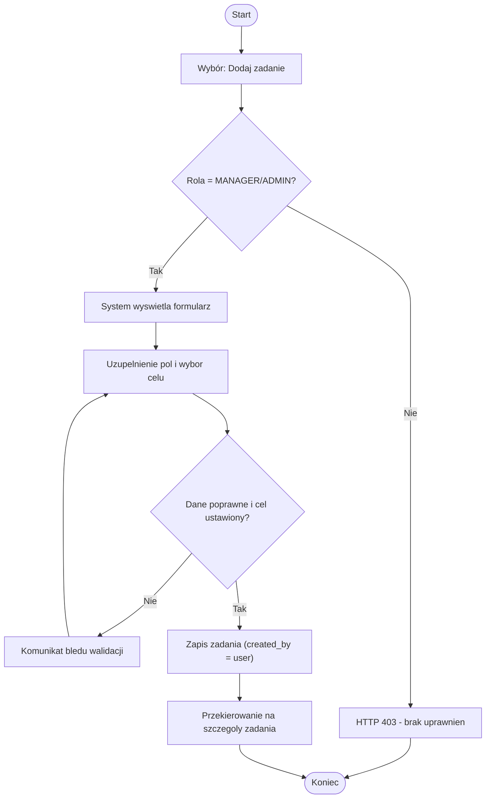
```mermaid
flowchart TD
    A([Start]) --> B["Wybór: Dodaj zadanie"]
    B --> R{"Rola = MANAGER/ADMIN?"}
    R -- Nie --> X[HTTP 403 - brak uprawnien]
    X --> Z([Koniec])
    R -- Tak --> C[System wyswietla formularz]
    C --> D[Uzupelnienie pol i wybor celu]
    D --> E{"Dane poprawne i cel ustawiony?"}
    E -- Nie --> F[Komunikat bledu walidacji]
    F --> D
    E -- Tak --> G["Zapis zadania (created_by = user)"]
    G --> H[Przekierowanie na szczegoly zadania]
    H --> Z
```

### 8.2. UC-10 - Oznaczenie zadania jako wykonane

**Aktor główny:** Pracownik, Właściciel lub Administrator.

**Cel:** aktualizacja statusu zadania.

**Warunki początkowe:** użytkownik jest zalogowany; pracownik może zmieniać status tylko zadań **przypisanych do siebie**.

**Przebieg podstawowy:**

1. Użytkownik otwiera szczegóły zadania i wybiera „Zmień status”.
2. System wyświetla formularz statusu (`TaskStatusForm`).
3. Użytkownik wybiera status (np. „Wykonane”) i zatwierdza.
4. System zapisuje nowy status.
5. System przekierowuje na widok szczegółów; na liście status (i kolor) odświeża się.

**Scenariusze alternatywne:**

- Status ustawiony na „Anulowane” — zadanie pozostaje w systemie, ale jest oznaczone jako anulowane.

**Sytuacje błędne:**

- Pracownik próbuje zmienić status cudzego zadania → zadanie nie jest dostępne w jego querysecie (404/odmowa).

**Rezultat:** zadanie ma zaktualizowany status; statusy „Zaległe”/„Nadchodzące” dla zadań zaplanowanych nadal liczone są z terminu.

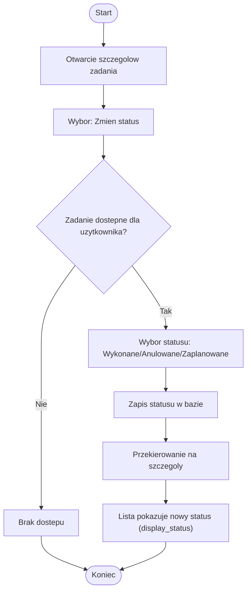
```mermaid
flowchart TD
    A([Start]) --> B[Otwarcie szczegolow zadania]
    B --> C[Wybor: Zmien status]
    C --> D{"Zadanie dostepne dla uzytkownika?"}
    D -- Nie --> X[Brak dostepu]
    X --> Z([Koniec])
    D -- Tak --> E[Wybor statusu: Wykonane/Anulowane/Zaplanowane]
    E --> F[Zapis statusu w bazie]
    F --> G[Przekierowanie na szczegoly]
    G --> H["Lista pokazuje nowy status (display_status)"]
    H --> Z
```

### 8.3. UC-03 - Dodanie zwierzęcia

**Aktor główny:** Właściciel lub Administrator.

**Cel:** dodanie zwierzęcia do ewidencji.

**Warunki początkowe:** użytkownik zalogowany, rola MANAGER lub ADMIN.

**Przebieg podstawowy:**

1. Użytkownik wybiera „+ Dodaj zwierzę”.
2. System wyświetla formularz (`AnimalForm`).
3. Użytkownik wpisuje nazwę, **unikalny identyfikator**, wybiera gatunek, płeć, lokalizację, stan zdrowia, datę urodzenia.
4. System sprawdza poprawność, w tym **unikalność identyfikatora** (ograniczenie `unique` na poziomie modelu/bazy).
5. System zapisuje zwierzę.
6. System przekierowuje na listę zwierząt.

**Scenariusze alternatywne:**

- Lokalizacja pozostawiona pusta (pole opcjonalne) — zwierzę zapisane bez przypisania.

**Sytuacje błędne:**

- Brak identyfikatora → błąd walidacji formularza.
- Identyfikator już istnieje → naruszenie unikalności (komunikat o duplikacie).

**Rezultat:** zwierzę widoczne na liście i w szczegółach, z historią notatek i zadań.

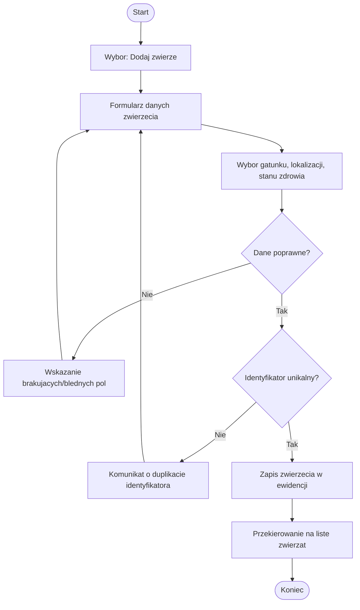
```mermaid
flowchart TD
    A([Start]) --> B["Wybor: Dodaj zwierze"]
    B --> C[Formularz danych zwierzecia]
    C --> D[Wybor gatunku, lokalizacji, stanu zdrowia]
    D --> E{"Dane poprawne?"}
    E -- Nie --> F[Wskazanie brakujacych/blednych pol]
    F --> C
    E -- Tak --> G{"Identyfikator unikalny?"}
    G -- Nie --> H[Komunikat o duplikacie identyfikatora]
    H --> C
    G -- Tak --> I[Zapis zwierzecia w ewidencji]
    I --> J[Przekierowanie na liste zwierzat]
    J --> Z([Koniec])
```

---

## 9. Diagram przypadków użycia

**Cel diagramu:** pokazać aktorów i powiązane z nimi przypadki użycia oraz relacje `include`/`extend`.

**Opis.** Właściciel i administrator mają dostęp do pełnego zakresu operacji; pracownik do przeglądania i zmiany statusu własnych zadań. UC-09 (przypomnienie) rozszerza UC-08 (`extend`). UC-13 (powiadomienie, planowane) jest dołączane (`include`) przez UC-09 i realizowane przez zewnętrzny system.

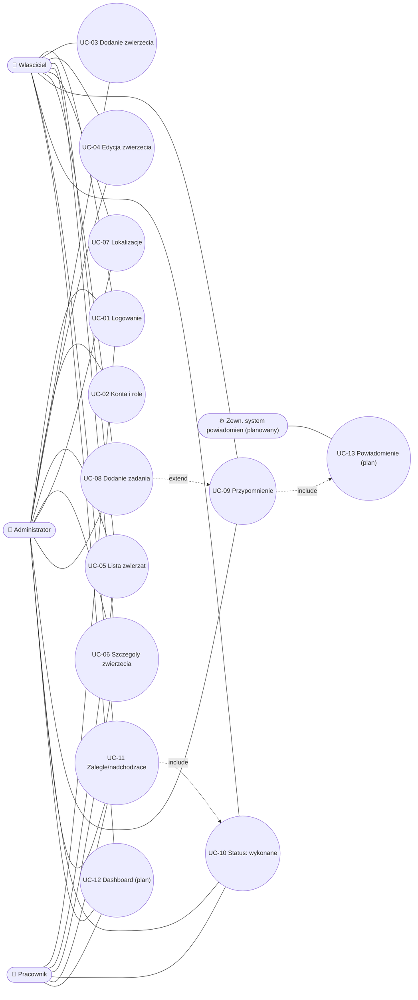
```mermaid
flowchart LR
    Wlasciciel(["👤 Wlasciciel"])
    Pracownik(["👤 Pracownik"])
    Administrator(["👤 Administrator"])
    Powiad(["⚙ Zewn. system powiadomien (planowany)"])

    UC01(("UC-01 Logowanie"))
    UC02(("UC-02 Konta i role"))
    UC03(("UC-03 Dodanie zwierzecia"))
    UC04(("UC-04 Edycja zwierzecia"))
    UC05(("UC-05 Lista zwierzat"))
    UC06(("UC-06 Szczegoly zwierzecia"))
    UC07(("UC-07 Lokalizacje"))
    UC08(("UC-08 Dodanie zadania"))
    UC09(("UC-09 Przypomnienie"))
    UC10(("UC-10 Status: wykonane"))
    UC11(("UC-11 Zalegle/nadchodzace"))
    UC12(("UC-12 Dashboard (plan)"))
    UC13(("UC-13 Powiadomienie (plan)"))

    Wlasciciel --- UC01 & UC03 & UC04 & UC05 & UC06 & UC07 & UC08 & UC09 & UC10 & UC11 & UC12
    Administrator --- UC01 & UC02 & UC03 & UC04 & UC05 & UC06 & UC07 & UC08 & UC09 & UC10 & UC11 & UC12
    Pracownik --- UC01 & UC05 & UC06 & UC10 & UC11 & UC12
    Powiad --- UC13

    UC08 -. extend .-> UC09
    UC09 -. include .-> UC13
    UC11 -. include .-> UC10
```

**Wyjaśnienie elementów:** elipsy to przypadki użycia, postacie to aktorzy, linie ciągłe to powiązania aktor–UC, linie przerywane to relacje `include`/`extend`.

**Z czego wynika:** z tabeli przypadków użycia w dokumentacji projektowej oraz z faktycznych ścieżek URL i uprawnień w kodzie (`config/urls.py`, mixiny ról, querysety filtrujące zadania pracownika).

**Powiązanie z wymaganiami prowadzącego:** realizuje wymóg „identyfikacja aktorów i przypadków użycia” oraz „diagram przypadków użycia”.

---

## 10. Analiza problemu i weryfikacja

**Główny problem.** Rozproszenie informacji o zwierzętach, ich lokalizacji, stanie zdrowia i obowiązkach prowadzi do pomijania ważnych czynności i braku jednego, wiarygodnego źródła prawdy.

**Dlaczego jest istotny.** W opiece nad zwierzętami pominięcie zadania zdrowotnego ma bezpośrednie konsekwencje dla dobrostanu. Podział pracy między właściciela i pracowników wymaga wspólnego, aktualnego widoku zadań i terminów.

**Jak aplikacja rozwiązuje problem.** Barney przenosi rozproszone dane do jednego modelu relacyjnego: zwierzę ma gatunek i lokalizację; zadanie dotyczy zwierzęcia albo lokalizacji; przypomnienie należy do zadania. Statusy zadań liczone z terminu uwidaczniają to, co zaległe i nadchodzące. Role rozdzielają zakres działań.

**Obsługiwane dane i procesy:** konta i role; zwierzęta i gatunki; lokalizacje; zadania i ich typy; przypomnienia; historia notatek. Główny proces: zaplanuj zadanie → (opcjonalnie) dodaj przypomnienie → wykonaj → oznacz jako wykonane.

**Jak sprawdzić, czy rozwiązanie działa:**

- testy automatyczne (45 testów, ~97% pokrycia) weryfikują logikę statusów, walidację, role i integralność danych,
- manualny przepływ użytkownika (zrzuty ekranu w sekcji 23): logowanie → utworzenie zadania → przypomnienie → zmiana statusu,
- reguły integralności: usunięcie lokalizacji nie kasuje zwierząt/zadań (test NFR-05), gatunek w użyciu jest chroniony przed usunięciem.

---

## 11. Model interakcji na wysokim poziomie abstrakcji

**Przepływ danych w systemie** (architektura klient–serwer, Django MVT + ORM):

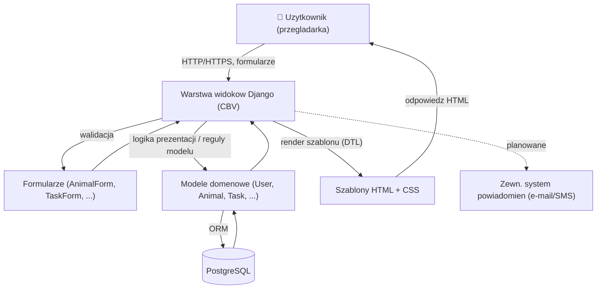
```mermaid
flowchart TD
    U["👤 Uzytkownik (przegladarka)"] -->|"HTTP/HTTPS, formularze"| V["Warstwa widokow Django (CBV)"]
    V -->|"walidacja"| FORM["Formularze (AnimalForm, TaskForm, ...)"]
    FORM --> V
    V -->|"logika prezentacji / reguly modelu"| M["Modele domenowe (User, Animal, Task, ...)"]
    M -->|"ORM"| DB[("PostgreSQL")]
    DB --> M
    M --> V
    V -->|"render szablonu (DTL)"| T["Szablony HTML + CSS"]
    T -->|"odpowiedz HTML"| U
    V -. "planowane" .-> N["Zewn. system powiadomien (e-mail/SMS)"]
```

**Opis przepływu.** Użytkownik wysyła żądanie z przeglądarki. Widok klasowy Django dobiera dane przez ORM, dla operacji zapisu uruchamia formularz z walidacją (np. reguła „zwierzę albo lokalizacja”), zapisuje zmiany w PostgreSQL i renderuje szablon HTML. Część logiki prezentacyjnej (status zadania liczony z terminu) znajduje się w metodach modelu. Integracja z zewnętrznym systemem powiadomień jest przewidziana, ale niezrealizowana.

**Przykład interakcji — dodanie zadania z przypomnieniem (wysokopoziomowo):**

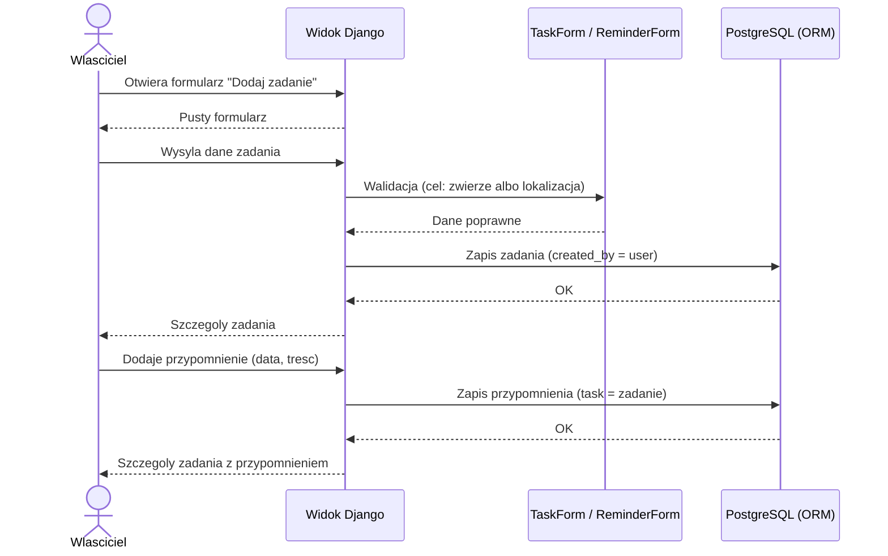
```mermaid
sequenceDiagram
    actor W as Wlasciciel
    participant V as Widok Django
    participant F as TaskForm / ReminderForm
    participant DB as PostgreSQL (ORM)

    W->>V: Otwiera formularz "Dodaj zadanie"
    V-->>W: Pusty formularz
    W->>V: Wysyla dane zadania
    V->>F: Walidacja (cel: zwierze albo lokalizacja)
    F-->>V: Dane poprawne
    V->>DB: Zapis zadania (created_by = user)
    DB-->>V: OK
    V-->>W: Szczegoly zadania
    W->>V: Dodaje przypomnienie (data, tresc)
    V->>DB: Zapis przypomnienia (task = zadanie)
    DB-->>V: OK
    V-->>W: Szczegoly zadania z przypomnieniem
```

---

## 12. Diagramy sekwencji dla 3 wybranych funkcjonalności

Wybrano trzy funkcjonalności najlepiej obrazujące działanie systemu: logowanie (kontrola dostępu), dodanie zadania z przypomnieniem (główna funkcjonalność) oraz oznaczenie zadania jako wykonane (cykl życia zadania).

### 12.1. Diagram sekwencji - Logowanie (UC-01)

**Opis funkcjonalności:** uwierzytelnienie użytkownika i utworzenie sesji.

**Uczestnicy:** Użytkownik, Przeglądarka, `LoginView` (Django auth), backend uwierzytelniania, baza danych, sesja.

**Przebieg komunikacji:** formularz logowania → sprawdzenie poświadczeń → utworzenie sesji → przekierowanie na stronę startową (lista zadań).

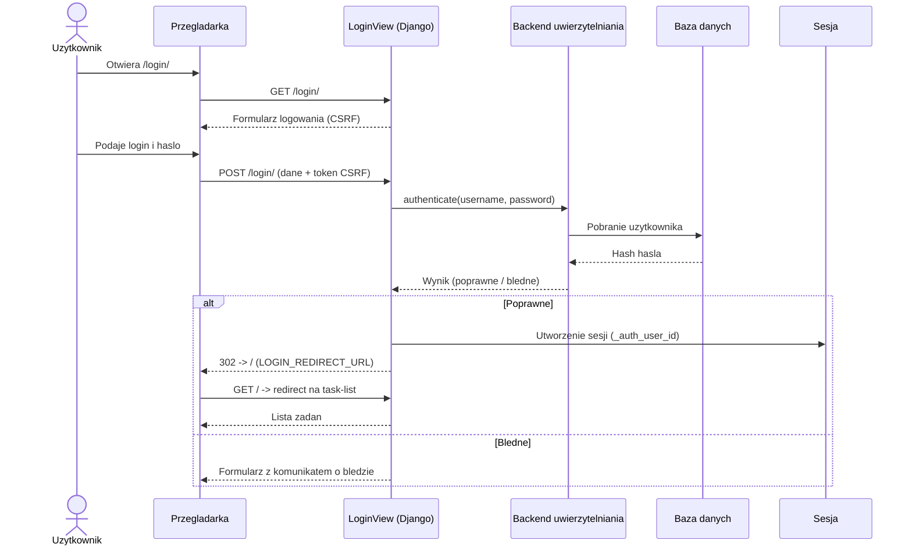
```mermaid
sequenceDiagram
    actor U as Uzytkownik
    participant B as Przegladarka
    participant L as LoginView (Django)
    participant A as Backend uwierzytelniania
    participant DB as Baza danych
    participant S as Sesja

    U->>B: Otwiera /login/
    B->>L: GET /login/
    L-->>B: Formularz logowania (CSRF)
    U->>B: Podaje login i haslo
    B->>L: POST /login/ (dane + token CSRF)
    L->>A: authenticate(username, password)
    A->>DB: Pobranie uzytkownika
    DB-->>A: Hash hasla
    A-->>L: Wynik (poprawne / bledne)
    alt Poprawne
        L->>S: Utworzenie sesji (_auth_user_id)
        L-->>B: 302 -> / (LOGIN_REDIRECT_URL)
        B->>L: GET / -> redirect na task-list
        L-->>B: Lista zadan
    else Bledne
        L-->>B: Formularz z komunikatem o bledzie
    end
```

**Wyjaśnienie:** logowanie realizuje wbudowany `LoginView` ze wskazanym szablonem `auth/login.html`; po sukcesie `home()` przekierowuje zalogowanego na `task-list`. Wynika z `config/urls.py` i ustawień `LOGIN_URL`, `LOGIN_REDIRECT_URL`.

### 12.2. Diagram sekwencji - Dodanie zadania z przypomnieniem (UC-08 + UC-09)

**Opis funkcjonalności:** zaplanowanie czynności i opcjonalne dodanie przypomnienia — kluczowy proces systemu.

**Uczestnicy:** Właściciel, Przeglądarka, `TaskCreateView`, `TaskForm`, ORM/baza, `ReminderCreateView`, `ReminderForm`.

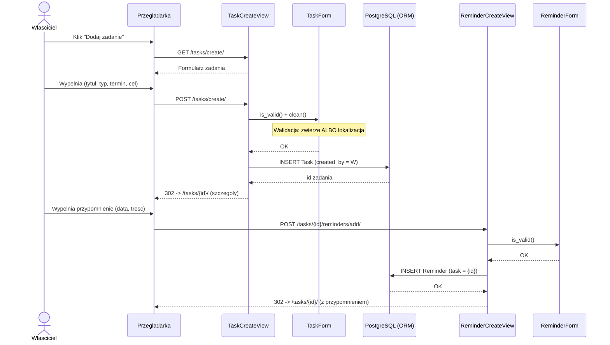
```mermaid
sequenceDiagram
    actor W as Wlasciciel
    participant B as Przegladarka
    participant TV as TaskCreateView
    participant TF as TaskForm
    participant DB as PostgreSQL (ORM)
    participant RV as ReminderCreateView
    participant RF as ReminderForm

    W->>B: Klik "Dodaj zadanie"
    B->>TV: GET /tasks/create/
    TV-->>B: Formularz zadania
    W->>B: Wypelnia (tytul, typ, termin, cel)
    B->>TV: POST /tasks/create/
    TV->>TF: is_valid() + clean()
    Note over TF: Walidacja: zwierze ALBO lokalizacja
    TF-->>TV: OK
    TV->>DB: INSERT Task (created_by = W)
    DB-->>TV: id zadania
    TV-->>B: 302 -> /tasks/{id}/ (szczegoly)
    W->>B: Wypelnia przypomnienie (data, tresc)
    B->>RV: POST /tasks/{id}/reminders/add/
    RV->>RF: is_valid()
    RF-->>RV: OK
    RV->>DB: INSERT Reminder (task = {id})
    DB-->>RV: OK
    RV-->>B: 302 -> /tasks/{id}/ (z przypomnieniem)
```

**Wyjaśnienie:** dwa osobne widoki klasowe (`TaskCreateView`, `ReminderCreateView`); przypomnienie powstaje w kontekście istniejącego zadania (`task_pk` w URL). Wynika z `tasks/views.py`, `tasks/forms.py`, `tasks/urls.py` oraz szablonu `task_detail.html` (formularz przypomnienia osadzony na karcie zadania).

### 12.3. Diagram sekwencji - Oznaczenie zadania jako wykonane (UC-10)

**Opis funkcjonalności:** zmiana statusu zadania przez uprawnionego użytkownika (w tym pracownika dla własnych zadań).

**Uczestnicy:** Pracownik, Przeglądarka, `TaskStatusUpdateView`, `TaskStatusForm`, ORM/baza.

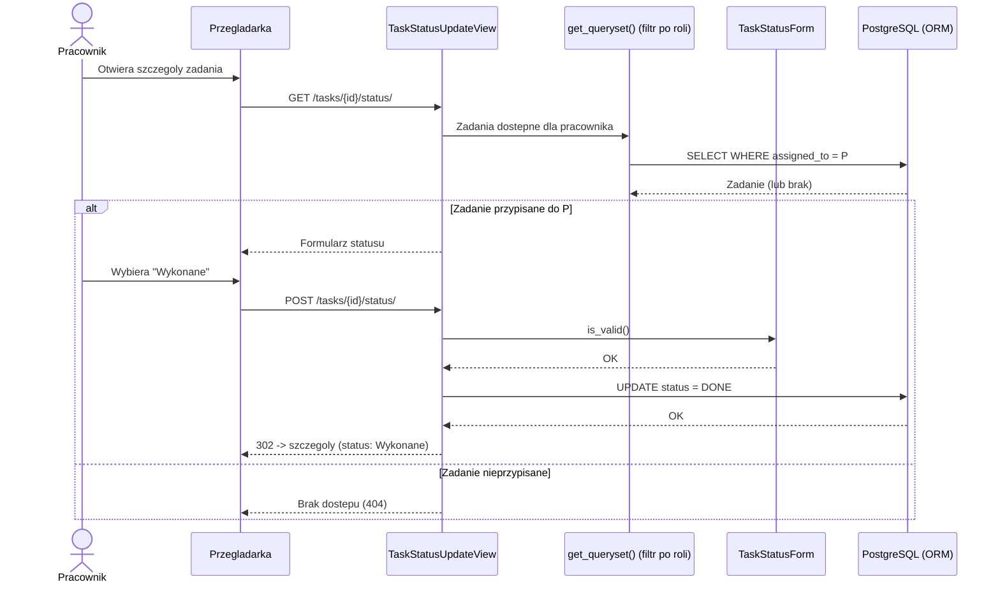
```mermaid
sequenceDiagram
    actor P as Pracownik
    participant B as Przegladarka
    participant SV as TaskStatusUpdateView
    participant Q as get_queryset() (filtr po roli)
    participant SF as TaskStatusForm
    participant DB as PostgreSQL (ORM)

    P->>B: Otwiera szczegoly zadania
    B->>SV: GET /tasks/{id}/status/
    SV->>Q: Zadania dostepne dla pracownika
    Q->>DB: SELECT WHERE assigned_to = P
    DB-->>Q: Zadanie (lub brak)
    alt Zadanie przypisane do P
        SV-->>B: Formularz statusu
        P->>B: Wybiera "Wykonane"
        B->>SV: POST /tasks/{id}/status/
        SV->>SF: is_valid()
        SF-->>SV: OK
        SV->>DB: UPDATE status = DONE
        DB-->>SV: OK
        SV-->>B: 302 -> szczegoly (status: Wykonane)
    else Zadanie nieprzypisane
        SV-->>B: Brak dostepu (404)
    end
```

**Wyjaśnienie:** `TaskStatusUpdateView` (tylko `LoginRequiredMixin`) zawęża queryset — pracownik widzi i modyfikuje wyłącznie własne zadania, właściciel/administrator wszystkie. Wynika z `tasks/views.py` (`get_queryset`) i testu `test_worker_can_update_own_task_status`.

---

## 13. Specyfikacja wymagań i sposób weryfikacji

| Wymaganie | Opis | Sposób weryfikacji |
| --- | --- | --- |
| FR-01 Logowanie | Dostęp po zalogowaniu; wylogowanie | Test funkcjonalny `AuthFunctionalTest`; ręczne logowanie kontem `wlasciciel/demo12345` |
| FR-02 Role i dostęp | Rozróżnienie ról; zapis tylko MANAGER/ADMIN | `UserModelUnitTest`, `*Functional.test_worker_cannot_create` (HTTP 403) |
| FR-03 Dodanie zwierzęcia | Zapis zwierzęcia z unikalnym ID | `AnimalFunctionalTest.test_manager_can_create`; walidacja `unique` |
| FR-04 Edycja zwierzęcia | Aktualizacja danych | `AnimalUpdateView`; weryfikacja przez formularz edycji |
| FR-05 Lista zwierząt | Wyświetlenie ewidencji | `AnimalFunctionalTest.test_list_renders_animals` |
| FR-06 Szczegóły zwierzęcia | Lokalizacja, stan zdrowia, notatki, zadania | `test_add_note_appears_in_history_with_author`; zrzut szczegółów |
| FR-07 Lokalizacje | CRUD lokalizacji | `BuildingFunctionalTest` |
| FR-08 Dodanie zadania | Zadanie dla zwierzęcia albo lokalizacji | `TaskModuleTest.test_form_*`, `TaskFunctionalTest.test_create_*` |
| FR-09 Przypomnienie | Przypomnienie powiązane z zadaniem | `TaskFunctionalTest.test_reminder_added_and_visible_in_detail` |
| FR-10 Status zadania | Oznaczenie jako wykonane | `TaskFunctionalTest.test_worker_can_update_own_task_status` |
| FR-11 Zaległe/nadchodzące | Statusy liczone z terminu | `TaskUnitTest.test_overdue_*`, `test_upcoming_*` |
| NFR-02 Dostęp po zalogowaniu | Anonimowy przekierowany do logowania | `*Functional.test_list_requires_login` (302 → /login/) |
| NFR-05 Integralność | Usunięcie lokalizacji nie kasuje zwierząt/zadań | `test_deleting_location_keeps_animal_nfr05`, `test_delete_location_does_not_delete_animals` |
| Ochrona gatunku | Gatunek w użyciu nie może zostać usunięty | `AnimalModuleTest.test_species_protected_when_in_use` (`ProtectedError`) |
| Dane referencyjne | Gatunki i typy zadań zasiane migracjami | `TaskModuleTest.test_seed_reference_data_present` |
| FR-12 Dashboard | Podsumowanie danych | **Brak implementacji** — wymaganie planowane |
| FR-13 Powiadomienia | Wysyłka do zewn. systemu | **Brak implementacji** — wymaganie planowane |

---

## 14. Model statyczny systemu

System jest zbudowany w architekturze Django (wzorzec MVT). Główne elementy:

**Aplikacje (pakiety) Django:**

- `users` — konto i role,
- `animals` — zwierzęta, gatunki, notatki zwierząt,
- `buildings` — lokalizacje i notatki lokalizacji,
- `tasks` — zadania, typy zadań, przypomnienia,
- `config` — ustawienia, routing główny, WSGI/ASGI.

**Modele domenowe (encje).** Opis na podstawie kodu (`*/models.py`):

**User** (`users.models.User`, dziedziczy po `AbstractUser`)
Konto użytkownika i jego rola.
- Atrybuty: `username`, `password`, `email`, ... (z `AbstractUser`), `role` (`ADMIN` / `MANAGER` / `WORKER`)
- Metody: `is_admin()`, `is_manager()`, `is_worker()`, `__str__()`

**Species** (`animals.models.Species`)
Gatunek zwierzęcia jako osobna, zarządzalna encja.
- Atrybuty: `name` (unikalny)
- Metody: `__str__()`

**Animal** (`animals.models.Animal`)
Zwierzę w ewidencji.
- Atrybuty: `name`, `identifier` (unikalny), `species` (FK→Species, `PROTECT`), `sex` (F/M/U), `building` (FK→Building, `SET_NULL`), `health_status` (HEALTHY/TREATMENT/SICK), `birth_date`, `created_at`
- Metody: `__str__()`, `latest_note()`

**AnimalNote** (`animals.models.AnimalNote`)
Wpis w historii notatek zwierzęcia.
- Atrybuty: `animal` (FK→Animal, `CASCADE`), `content`, `author` (FK→User, `SET_NULL`), `created_at`
- Metody: `__str__()`

**Building** (`buildings.models.Building`)
Lokalizacja: stajnia, boks, zagroda, wybieg.
- Atrybuty: `name`, `type` (STABLE/STALL/PEN/PADDOCK), `created_by` (FK→User, `SET_NULL`), `created_at`
- Metody: `__str__()`, `latest_note()`

**BuildingNote** (`buildings.models.BuildingNote`)
Wpis w historii notatek lokalizacji.
- Atrybuty: `building` (FK→Building, `CASCADE`), `content`, `author` (FK→User, `SET_NULL`), `created_at`
- Metody: `__str__()`

**TaskType** (`tasks.models.TaskType`)
Typ zadania w kategorii HEALTH lub MANAGEMENT.
- Atrybuty: `name`, `category` (HEALTH/MANAGEMENT), `description`
- Metody: `__str__()`

**Task** (`tasks.models.Task`)
Zadanie dotyczące zwierzęcia albo lokalizacji.
- Atrybuty: `title`, `description`, `task_type` (FK→TaskType, `SET_NULL`), `assigned_to` (FK→User, `SET_NULL`), `created_by` (FK→User, `SET_NULL`), `status` (PLANNED/DONE/CANCELLED), `due_date`, `created_at`, `animal` (FK→Animal, `SET_NULL`), `building` (FK→Building, `SET_NULL`)
- Metody: `__str__()`, `display_status()` (liczy „Zaległe”/„Nadchodzące”/„Zaplanowane” z terminu), `status_code()` (kod CSS), `target` (property: zwierzę albo lokalizacja)

**Reminder** (`tasks.models.Reminder`)
Przypomnienie powiązane z zadaniem.
- Atrybuty: `task` (FK→Task, `CASCADE`), `date`, `message`, `status` (ACTIVE/SENT/CANCELLED), `created_at`
- Metody: `__str__()`

**Warstwa widoków (Controllers/Views).** Klasowe widoki Django (`ListView`, `DetailView`, `CreateView`, `UpdateView`, `DeleteView`) w `*/views.py`, np. `AnimalListView`, `TaskCreateView`, `TaskStatusUpdateView`, `ReminderCreateView`. Kontrola dostępu: `LoginRequiredMixin` oraz `AdminOrManagerRequiredMixin` (`users/mixins.py`).

**Warstwa formularzy.** `AnimalForm`, `AnimalNoteForm`, `BuildingForm`, `BuildingNoteForm`, `TaskForm` (z regułą celu w `clean()`), `TaskStatusForm`, `ReminderForm`, `RegisterForm`.

**Warstwa szablonów (View/UI).** Szablony DTL w `templates/` (base, navbar, listy, szczegóły, formularze) + arkusz `static/css/style.css`.

> **Rozbieżność z prezentacją.** Prezentacja zakładała osobną **warstwę serwisów** (`services.py`, `AnimalService`, `TaskService`, `ReminderService`) oraz adapter powiadomień. W kodzie **nie ma plików `services.py`** — logika domenowa znajduje się w metodach modeli, walidacja w formularzach, a sterowanie w klasowych widokach. To uproszczenie typowe dla aplikacji Django na etapie prototypu.

---

## 15. Diagramy klas i struktury danych

Aby zachować czytelność, model rozbito na kilka mniejszych diagramów.

### 15.1. Użytkownicy i role

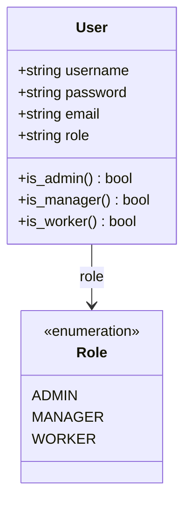
```mermaid
classDiagram
    class User {
        +string username
        +string password
        +string email
        +string role
        +is_admin() bool
        +is_manager() bool
        +is_worker() bool
    }
    class Role {
        <<enumeration>>
        ADMIN
        MANAGER
        WORKER
    }
    User --> Role : role
```

**Opis:** rola jest polem wyboru (`TextChoices`) na modelu `User`, nie osobną tabelą — to różnica względem diagramu obiektów z prezentacji (gdzie Role była osobnym obiektem). Metody pomocnicze sterują uprawnieniami w widokach.

### 15.2. Główne encje domenowe i relacje

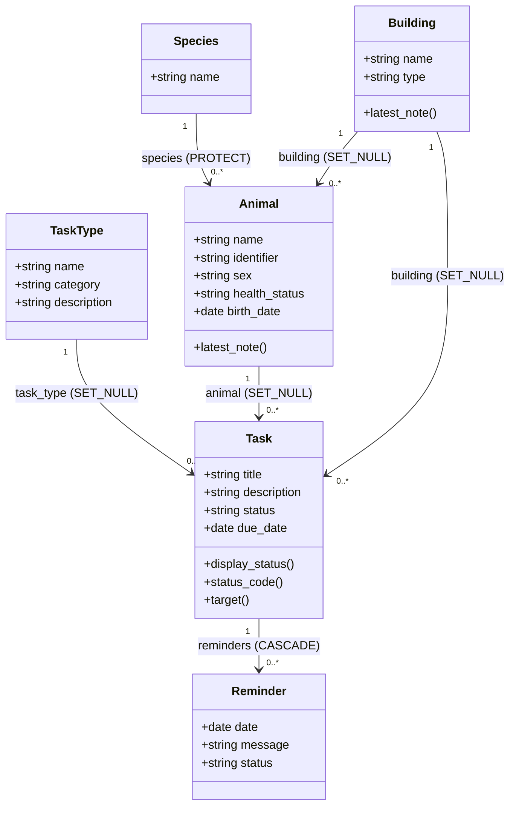
```mermaid
classDiagram
    class Species {
        +string name
    }
    class Animal {
        +string name
        +string identifier
        +string sex
        +string health_status
        +date birth_date
        +latest_note()
    }
    class Building {
        +string name
        +string type
        +latest_note()
    }
    class TaskType {
        +string name
        +string category
        +string description
    }
    class Task {
        +string title
        +string description
        +string status
        +date due_date
        +display_status()
        +status_code()
        +target()
    }
    class Reminder {
        +date date
        +string message
        +string status
    }

    Species "1" --> "0..*" Animal : species (PROTECT)
    Building "1" --> "0..*" Animal : building (SET_NULL)
    TaskType "1" --> "0..*" Task : task_type (SET_NULL)
    Animal "1" --> "0..*" Task : animal (SET_NULL)
    Building "1" --> "0..*" Task : building (SET_NULL)
    Task "1" --> "0..*" Reminder : reminders (CASCADE)
```

**Opis:** odwzorowuje relacje z `models.py`. Kluczowe reguły kasowania widoczne jako adnotacje: `PROTECT` (nie można usunąć używanego gatunku), `SET_NULL` (usunięcie lokalizacji/typu nie kasuje powiązanych rekordów — NFR-05), `CASCADE` (usunięcie zadania kasuje jego przypomnienia). Zadanie wskazuje na zwierzę **albo** lokalizację (reguła w `TaskForm.clean`).

### 15.3. Historia notatek

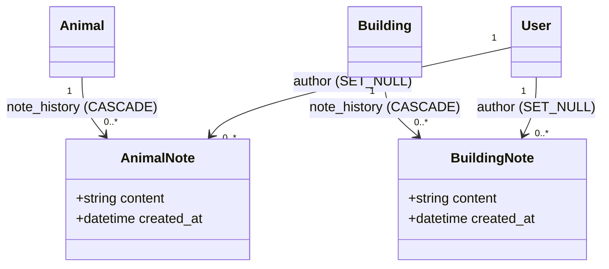
```mermaid
classDiagram
    class Animal
    class Building
    class User
    class AnimalNote {
        +string content
        +datetime created_at
    }
    class BuildingNote {
        +string content
        +datetime created_at
    }
    Animal "1" --> "0..*" AnimalNote : note_history (CASCADE)
    Building "1" --> "0..*" BuildingNote : note_history (CASCADE)
    User "1" --> "0..*" AnimalNote : author (SET_NULL)
    User "1" --> "0..*" BuildingNote : author (SET_NULL)
```

**Opis:** notatki tworzą historię (sortowanie malejąco po dacie, najnowsza = „aktualna”). Autor jest zapamiętywany; usunięcie autora zachowuje notatkę (`SET_NULL`). Funkcjonalność rozszerza pierwotną specyfikację (pojedyncze „notatki” → pełna historia z autorem).

### 15.4. Model danych (ERD)

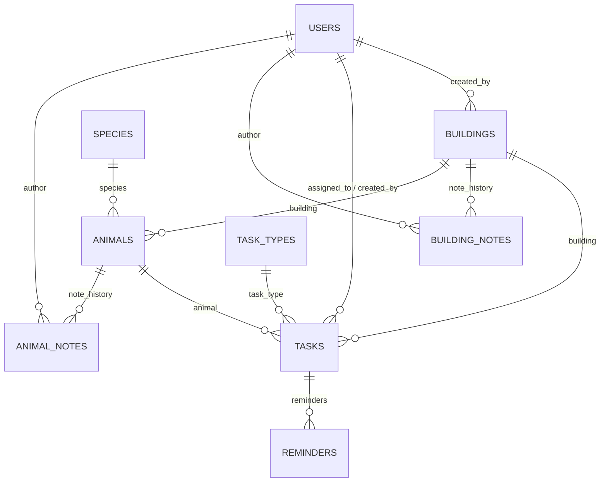
```mermaid
erDiagram
    USERS ||--o{ ANIMAL_NOTES : "author"
    USERS ||--o{ BUILDING_NOTES : "author"
    USERS ||--o{ TASKS : "assigned_to / created_by"
    USERS ||--o{ BUILDINGS : "created_by"
    SPECIES ||--o{ ANIMALS : "species"
    BUILDINGS ||--o{ ANIMALS : "building"
    ANIMALS ||--o{ ANIMAL_NOTES : "note_history"
    BUILDINGS ||--o{ BUILDING_NOTES : "note_history"
    TASK_TYPES ||--o{ TASKS : "task_type"
    ANIMALS ||--o{ TASKS : "animal"
    BUILDINGS ||--o{ TASKS : "building"
    TASKS ||--o{ REMINDERS : "reminders"
```

**Opis:** relacyjny model danych mapowany przez ORM Django na PostgreSQL. Tabele odpowiadają modelom; klucze obce realizują relacje z sekcji 15.2–15.3.

---

## 16. Diagram kontekstu C4

**Cel diagramu:** pokazać system Barney jako całość, jego użytkowników i systemy zewnętrzne (poziom 1 modelu C4 — kontekst).

**Opis.** Użytkownicy (właściciel, pracownik, administrator) korzystają z aplikacji przez przeglądarkę. System zapisuje i odczytuje dane z relacyjnej bazy PostgreSQL. Zewnętrzny system powiadomień jest elementem otoczenia, ale integracja pozostaje planowana.

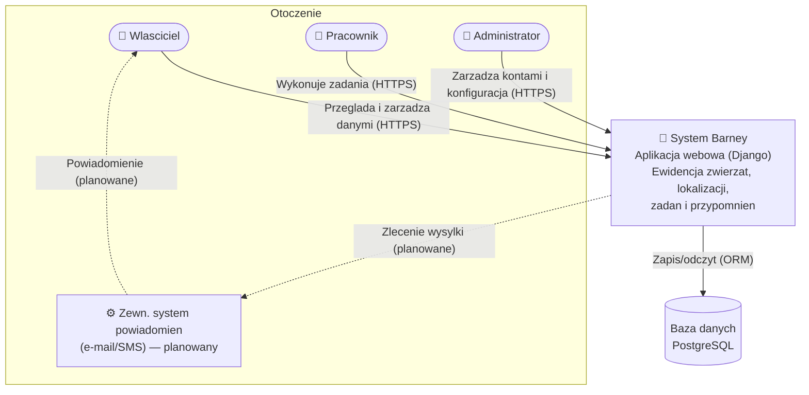
```mermaid
flowchart TB
    subgraph Otoczenie
        Wl(["👤 Wlasciciel"])
        Pr(["👤 Pracownik"])
        Ad(["👤 Administrator"])
        Powiad["⚙ Zewn. system powiadomien<br/>(e-mail/SMS) — planowany"]
    end

    Barney["🐐 System Barney<br/>Aplikacja webowa (Django)<br/>Ewidencja zwierzat, lokalizacji,<br/>zadan i przypomnien"]

    DB[("Baza danych<br/>PostgreSQL")]

    Wl -->|"Przeglada i zarzadza danymi (HTTPS)"| Barney
    Pr -->|"Wykonuje zadania (HTTPS)"| Barney
    Ad -->|"Zarzadza kontami i konfiguracja (HTTPS)"| Barney
    Barney -->|"Zapis/odczyt (ORM)"| DB
    Barney -.->|"Zlecenie wysylki (planowane)"| Powiad
    Powiad -.->|"Powiadomienie (planowane)"| Wl
```

**Wyjaśnienie elementów:** prostokąt centralny to system, postacie to aktorzy-ludzie, walec to magazyn danych, linie przerywane to relacje planowane (niezrealizowane).

**Z czego wynika:** z diagramu C4 w prezentacji oraz z faktycznej konfiguracji (`docker-compose.yaml` z usługami `web` i `db`, brak kontenera systemu powiadomień).

**Powiązanie z wymaganiami prowadzącego:** realizuje wymóg „diagram kontekstu C4”.

---

## 17. Diagram komponentów

**Cel:** pokazać wewnętrzną strukturę aplikacji i współpracę komponentów.

**Opis.** Przeglądarka komunikuje się z warstwą widoków Django. Widoki korzystają z formularzy (walidacja) i modeli (logika domenowa), a modele z bazą przez ORM. Każda aplikacja (users/animals/buildings/tasks) ma własny komplet widoków, formularzy i modeli. Mixiny ról kontrolują dostęp.

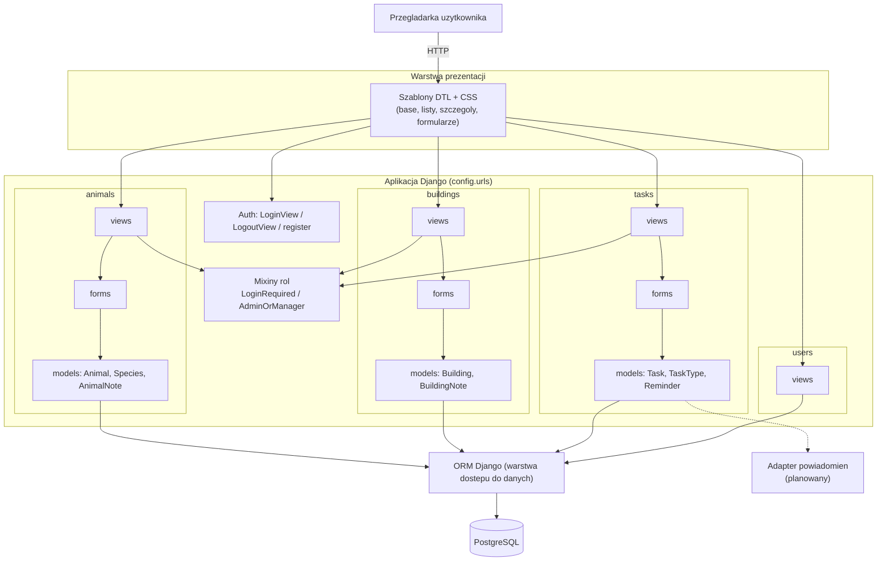
```mermaid
flowchart TD
    BR["Przegladarka uzytkownika"]
    subgraph FE["Warstwa prezentacji"]
        TPL["Szablony DTL + CSS<br/>(base, listy, szczegoly, formularze)"]
    end
    subgraph APP["Aplikacja Django (config.urls)"]
        AUTH["Auth: LoginView / LogoutView / register"]
        MIX["Mixiny rol<br/>LoginRequired / AdminOrManager"]
        subgraph U["users"]
            UV["views"]
        end
        subgraph A["animals"]
            AV["views"]
            AF["forms"]
            AM["models: Animal, Species, AnimalNote"]
        end
        subgraph B["buildings"]
            BV["views"]
            BF["forms"]
            BM["models: Building, BuildingNote"]
        end
        subgraph T["tasks"]
            TV["views"]
            TF["forms"]
            TM["models: Task, TaskType, Reminder"]
        end
    end
    ORM["ORM Django (warstwa dostepu do danych)"]
    DB[("PostgreSQL")]
    NOT["Adapter powiadomien<br/>(planowany)"]

    BR -->|HTTP| TPL
    TPL --> AUTH
    TPL --> AV & BV & TV & UV
    AV --> MIX
    BV --> MIX
    TV --> MIX
    AV --> AF --> AM
    BV --> BF --> BM
    TV --> TF --> TM
    AM --> ORM
    BM --> ORM
    TM --> ORM
    UV --> ORM
    ORM --> DB
    TM -.-> NOT
```

**Wyjaśnienie elementów:** prostokąty zgrupowane to aplikacje Django; strzałki ciągłe to realne zależności w kodzie; element przerywany (adapter powiadomień) jest planowany. Brak osobnej warstwy „Service” — to świadome uproszczenie względem prezentacji (patrz sekcja 14).

**Z czego wynika:** z `config/urls.py`, `*/views.py`, `*/forms.py`, `*/models.py`, `users/mixins.py`.

**Powiązanie z wymaganiami prowadzącego:** realizuje wymóg „diagram komponentów”.

---

## 18. Architektura systemu

**Styl architektoniczny.** Klient–serwer; po stronie serwera wzorzec Django **MVT** (Model–View–Template), będący wariantem MVC: „View” Django pełni rolę kontrolera, a „Template” rolę widoku. Dostęp do danych przez **ORM** (wzorzec Active Record / Data Mapper hybrydowo realizowany przez Django ORM).

**Podział na warstwy:**

1. **Prezentacja** — szablony DTL + CSS, renderowane po stronie serwera.
2. **Aplikacyjna / sterowanie** — klasowe widoki Django; kontrola ról przez mixiny; walidacja w formularzach.
3. **Domena** — modele (`User`, `Animal`, `Species`, `Building`, `Task`, `TaskType`, `Reminder`) wraz z logiką (np. `Task.display_status`).
4. **Dostęp do danych** — ORM Django (QuerySet/Manager).
5. **Infrastruktura** — serwer aplikacji (Django dev server w prototypie), PostgreSQL, konfiguracja przez `.env`, konteneryzacja Docker.

**Przepływ żądania przez system:** żądanie HTTP → routing (`config/urls.py` → `*/urls.py`) → widok (sprawdzenie sesji i roli) → (dla zapisu) formularz + walidacja → ORM → PostgreSQL → render szablonu → odpowiedź HTML.

**Sposób dostępu do danych:** wyłącznie przez ORM (brak surowego SQL). Querysety w widokach filtrują dane wg roli (np. pracownik widzi tylko swoje zadania).

**Wzorce projektowe i mechanizmy:**

- Class-Based Views + generyczne widoki CRUD,
- Mixiny uprawnień (`LoginRequiredMixin`, `UserPassesTestMixin`),
- ModelForm z walidacją regułową (`clean`),
- TextChoices jako enumeracje statusów/ról/typów,
- migracje seedujące dane referencyjne (gatunki, typy zadań),
- konfiguracja przez zmienne środowiskowe (`python-dotenv`).

**Zależności między modułami:** `animals` zależy od `buildings` (FK lokalizacji); `tasks` zależy od `animals` i `buildings` (cel zadania) oraz od `users` (przypisanie/autor); wszystkie od `users` (model użytkownika, mixiny).

**Decyzje architektoniczne:**

- Django jako framework „baterie w zestawie” — gotowe logowanie, uprawnienia, panel admina, ORM, migracje (skraca czas budowy prototypu).
- PostgreSQL jako relacyjna baza dobrze pasująca do wyraźnych zależności w modelu danych.
- Rezygnacja z warstwy serwisów na etapie prototypu (logika w modelach/formularzach).

**Ograniczenia:**

- prototyp uruchamiany na deweloperskim serwerze Django (bez nginx/WSGI produkcyjnego),
- `DEBUG=True` i jawny `SECRET_KEY` w repozytorium — do zmiany przed produkcją,
- brak dashboardu i realnej integracji powiadomień.

**Kierunki rozwoju:** dashboard (UC-12), adapter i integracja powiadomień (UC-13), dedykowane UI zarządzania gatunkami/typami zadań i kontami, wydzielenie warstwy serwisów wraz ze wzrostem logiki, wdrożenie produkcyjne za nginx + Gunicorn/uvicorn.

---

## 19. Wybór technologii

> **Uwaga o rozbieżnościach.** Prezentacja wymieniała m.in. **Bootstrap**, **nginx** oraz **pytest**. W rzeczywistym kodzie: frontend opiera się na **własnym CSS** (bez Bootstrapa), wdrożenie używa **deweloperskiego serwera Django** (bez nginx), a testy uruchamiane są przez **`django.test` (unittest) + coverage** (bez pytest). Poniżej opisano stan faktyczny.

| Obszar | Technologia (w kodzie) | Gdzie używana | Dlaczego / zalety |
| --- | --- | --- | --- |
| Język | **Python 3.12** | całość | czytelny, szybkie prototypowanie, ekosystem Django |
| Framework backendu | **Django 6.0.6** | `config`, wszystkie aplikacje | gotowe logowanie, role, panel admina, ORM, migracje |
| Baza danych | **PostgreSQL 16** | `docker-compose` (usługa `db`), `settings.DATABASES` | relacyjny model dobrze pasuje do zależności danych |
| Baza (testy/lokalnie) | **SQLite** | `config/settings_test.py` (`:memory:`) | szybkie testy bez stawiania PostgreSQL |
| Sterownik bazy | **psycopg 3** | połączenie z PostgreSQL | aktualny sterownik PostgreSQL dla Pythona |
| Warstwa widoku (UI) | **Szablony Django (DTL)** + **własny CSS** | `templates/`, `static/css/style.css` | brak zależności od bibliotek front-end; pełna kontrola wyglądu |
| Typografia | Google Fonts (Fraunces, Inter) | `base.html` | spójna, czytelna typografia |
| Konfiguracja | **python-dotenv** + `.env` | `config/settings.py` | sekrety i parametry poza kodem |
| Konteneryzacja | **Docker** + **docker-compose** | `Dockerfile`, `docker-compose.yaml` | powtarzalne środowisko (web + db) |
| Testy | **django.test (unittest)** | `*/tests.py` | wbudowane, izolowana baza testowa, klient HTTP |
| Pokrycie | **coverage** | `.coveragerc`, `requirements-dev.txt` | pomiar pokrycia (~97%) |
| CI | **GitHub Actions** | `.github/workflows/tests.yml` (wg PLAN_TESTOW) | automatyczne testy przy push/PR |
| Kontrola wersji | **Git / GitHub** | całe repozytorium | historia zmian, współpraca |

Najważniejsze uzasadnienia:

- **Django** wybrano, bo dostarcza „od ręki” uwierzytelnianie, system uprawnień, panel administracyjny, ORM i migracje — co skraca budowę prototypu i pozwala skupić się na logice domenowej. Używane w całym backendzie.
- **PostgreSQL** dobrze odwzorowuje relacyjny model danych (zwierzę–gatunek–lokalizacja, zadanie–przypomnienie). Używana w środowisku Docker i docelowo produkcyjnym.
- **Szablony Django + własny CSS** zamiast frameworka UI — dla prostego, lekkiego interfejsu prototypu to wystarczające i pozbawione narzutu zależności rozwiązanie.
- **Docker** zapewnia powtarzalne środowisko uruchomieniowe (aplikacja + baza) jednym poleceniem.

---

## 20. Diagram wdrożenia

**Cel:** pokazać rozmieszczenie elementów w środowisku uruchomieniowym.

**Opis.** W obecnym prototypie aplikacja działa w kontenerze Docker (`web`) jako deweloperski serwer Django i komunikuje się z kontenerem bazy (`db`, PostgreSQL). Użytkownik łączy się przez przeglądarkę. Diagram pokazuje też, jak środowisko można rozszerzyć produkcyjnie (nginx + serwer WSGI/ASGI, system powiadomień).

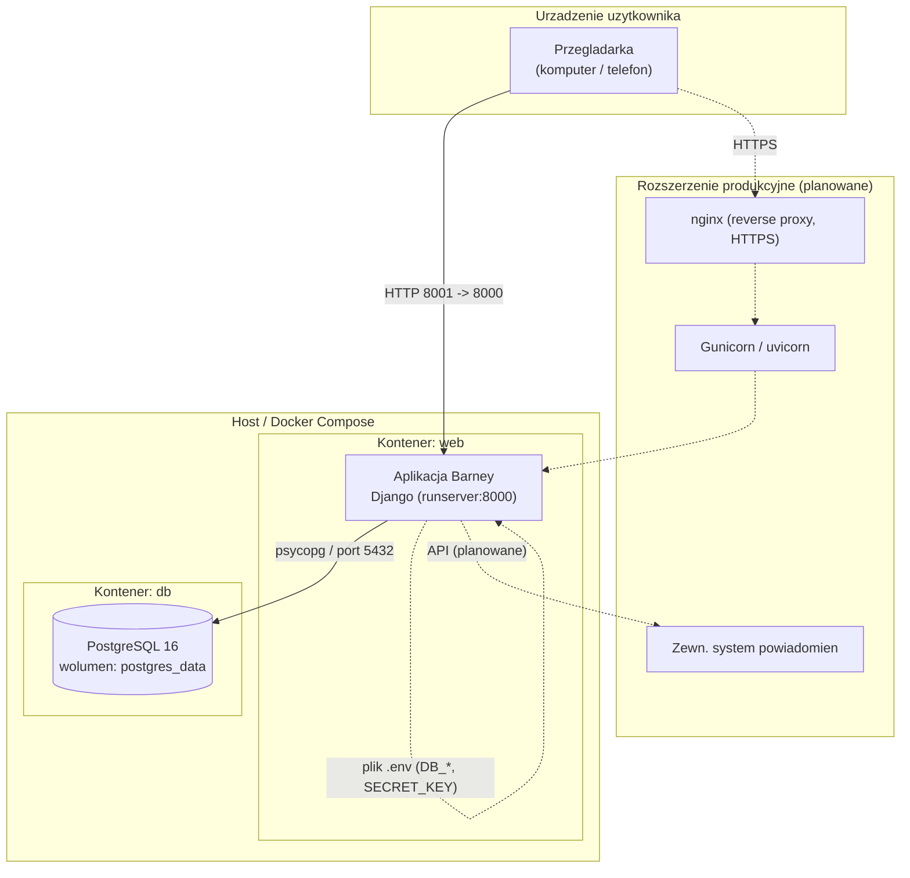
```mermaid
flowchart TB
    subgraph Klient["Urzadzenie uzytkownika"]
        BR["Przegladarka<br/>(komputer / telefon)"]
    end

    subgraph Host["Host / Docker Compose"]
        subgraph WebC["Kontener: web"]
            DJ["Aplikacja Barney<br/>Django (runserver:8000)"]
        end
        subgraph DbC["Kontener: db"]
            PG[("PostgreSQL 16<br/>wolumen: postgres_data")]
        end
    end

    subgraph Prod["Rozszerzenie produkcyjne (planowane)"]
        NGINX["nginx (reverse proxy, HTTPS)"]
        WSGI["Gunicorn / uvicorn"]
        NOTI["Zewn. system powiadomien"]
    end

    BR -->|"HTTP 8001 -> 8000"| DJ
    DJ -->|"psycopg / port 5432"| PG
    DJ -.->|"plik .env (DB_*, SECRET_KEY)"| DJ

    BR -.->|"HTTPS"| NGINX
    NGINX -.-> WSGI
    WSGI -.-> DJ
    DJ -.->|"API (planowane)"| NOTI
```

**Opis węzłów:**

- **Przeglądarka** — klient; w `docker-compose` port hosta **8001** mapowany na **8000** w kontenerze.
- **Kontener `web`** — aplikacja Django uruchamiana komendą `python manage.py runserver 0.0.0.0:8000`; kod montowany jako wolumen.
- **Kontener `db`** — PostgreSQL 16 z trwałym wolumenem `postgres_data`, konfiguracja z `.env`.
- **Elementy planowane** (przerywane) — nginx + serwer WSGI/ASGI do wdrożenia produkcyjnego oraz zewnętrzny system powiadomień.

**Z czego wynika:** z `Dockerfile`, `docker-compose.yaml`, `.env`, `config/settings.py`.

**Powiązanie z wymaganiami prowadzącego:** realizuje wymóg „diagram wdrożenia”.

### 20.1. Diagram integracji (dostęp do danych)

Projekt integruje się z bazą danych przez ORM. Plik `.env` dostarcza parametry połączenia.

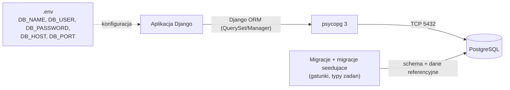
```mermaid
flowchart LR
    APP["Aplikacja Django"] -->|"Django ORM (QuerySet/Manager)"| DRV["psycopg 3"]
    DRV -->|"TCP 5432"| PG[("PostgreSQL")]
    ENV[".env<br/>DB_NAME, DB_USER, DB_PASSWORD,<br/>DB_HOST, DB_PORT"] -.->|"konfiguracja"| APP
    MIG["Migracje + migracje seedujace<br/>(gatunki, typy zadan)"] -->|"schema + dane referencyjne"| PG
```

**Opis:** jedyną zewnętrzną integracją zrealizowaną w kodzie jest relacyjna baza danych (przez ORM). Integracja z systemem powiadomień pozostaje planowana.

---

## 21. Implementacja systemu

### 21.1. Struktura katalogów

```
barney/
├── config/                 # ustawienia, routing, WSGI/ASGI
│   ├── settings.py         # PostgreSQL, INSTALLED_APPS, AUTH_USER_MODEL, pl
│   ├── settings_test.py    # SQLite :memory: do testów
│   ├── urls.py             # routing glowny + login/logout + home->task-list
│   ├── wsgi.py / asgi.py
├── users/                  # konto i role
│   ├── models.py           # User(AbstractUser) + role
│   ├── mixins.py           # AdminOrManagerRequiredMixin
│   ├── views.py / urls.py / forms.py
│   └── management/commands/seed_demo.py  # dane demonstracyjne
├── animals/                # zwierzeta, gatunki, notatki
│   ├── models.py           # Species, Animal, AnimalNote
│   ├── views.py / urls.py / forms.py
│   └── migrations/0004_seed_species.py   # gatunki referencyjne
├── buildings/              # lokalizacje + notatki
│   ├── models.py           # Building, BuildingNote
│   └── views.py / urls.py / forms.py
├── tasks/                  # zadania, typy, przypomnienia
│   ├── models.py           # TaskType, Task, Reminder
│   ├── views.py / urls.py / forms.py
│   └── migrations/0003_seed_tasktypes.py # typy zadan referencyjne
├── templates/              # base, navbar, listy, szczegoly, formularze, auth
├── static/css/style.css    # wlasny arkusz stylow
├── Dockerfile
├── docker-compose.yaml     # uslugi web + db
├── requirements.txt        # Django, psycopg, python-dotenv, ...
├── requirements-dev.txt    # coverage
├── .coveragerc
├── .env                    # DB_* (prototyp)
├── PLAN_TESTOW.md
└── manage.py
```

### 21.2. Najważniejsze pliki i klasy

- `users/models.py` — `User` z rolą i metodami `is_admin/is_manager/is_worker`.
- `users/mixins.py` — `AdminOrManagerRequiredMixin` (kontrola zapisu).
- `animals/models.py` — `Species`, `Animal` (z `latest_note`), `AnimalNote`.
- `buildings/models.py` — `Building`, `BuildingNote`.
- `tasks/models.py` — `TaskType`, `Task` (`display_status`, `status_code`, `target`), `Reminder`.
- `tasks/forms.py` — `TaskForm.clean()` wymusza cel (zwierzę albo lokalizacja).
- `tasks/views.py` — `TaskListView`/`TaskDetailView` filtrują po roli; `TaskStatusUpdateView`; `ReminderCreateView`.
- `users/management/commands/seed_demo.py` — idempotentne dane demonstracyjne (konta, lokalizacje, zwierzęta, notatki, zadania, przypomnienia).

### 21.3. Główna funkcjonalność prototypu

Działa pełny cykl: logowanie → przegląd zwierząt/lokalizacji → utworzenie zadania (z walidacją celu) → dodanie przypomnienia → zmiana statusu zadania → wyróżnienie zadań zaległych/nadchodzących na liście → historia notatek z autorem. Role ograniczają zakres (pracownik: przegląd + status własnych zadań).

### 21.4. Uruchomienie projektu

**Wariant z Dockerem (PostgreSQL):**

```
docker compose up --build
# migracje i dane demo:
docker compose exec web python manage.py migrate
docker compose exec web python manage.py seed_demo
# aplikacja: http://localhost:8001
```

**Wariant lokalny (np. SQLite do szybkich testów):**

```
pip install -r requirements.txt
python manage.py migrate
python manage.py seed_demo
python manage.py runserver
```

Konta demonstracyjne (hasło `demo12345`): `admin`, `wlasciciel`, `pracownik`.

### 21.5. Stan implementacji

- **Zaimplementowane:** konta i role, logowanie/rejestracja, CRUD zwierząt i lokalizacji, zadania z typami i walidacją celu, statusy liczone z terminu, oznaczanie statusu, przypomnienia (zapis i podgląd), historia notatek, dane demonstracyjne, testy, Docker.
- **Częściowe:** zarządzanie kontami/rolami i gatunkami/typami zadań — tylko przez panel administracyjny Django (brak dedykowanego UI); przypomnienia — bez realnej wysyłki.
- **Brakujące / planowane:** dashboard (UC-12), integracja z zewnętrznym systemem powiadomień (UC-13), wdrożenie produkcyjne (nginx + WSGI), reset hasła.

---

## 22. Testy systemu

### 22.1. Cel testowania

Potwierdzenie, że aplikacja realizuje wymagania funkcjonalne i niefunkcjonalne oraz że kluczowe reguły biznesowe (statusy zadań, walidacja celu, kontrola ról, integralność danych) działają poprawnie i nie ulegają regresji.

### 22.2. Testy jednostkowe

Istnieją. Sprawdzają logikę modeli w izolacji od bazy i HTTP:

- `Task.display_status()` / `status_code()` — wyliczanie „Zaległe”/„Nadchodzące”/„Zaplanowane” z terminu (`TaskUnitTest`),
- metody ról `User.is_admin/is_manager/is_worker` i domyślna rola WORKER (`UserModelUnitTest`),
- reprezentacje tekstowe i `latest_note()` (`AnimalModelUnitTest`, `BuildingModelUnitTest`).

Uruchamianie: `python manage.py test` (lub z `DJANGO_SETTINGS_MODULE=config.settings_test` na SQLite).

### 22.3. Testy integracyjne / modułowe

Istnieją (poziom „modułowy” — model + formularz + relacje z udziałem bazy):

- walidacja `TaskForm` (cel: zwierzę albo lokalizacja), relacje `target`, przypomnienia powiązane z zadaniem (`TaskModuleTest`),
- integralność NFR-05: usunięcie lokalizacji nie kasuje zwierząt/zadań; ochrona gatunku w użyciu (`AnimalModuleTest`, `BuildingModuleTest`),
- kolejność historii notatek i `latest_note` (`AnimalModuleTest`),
- obecność danych referencyjnych zasianych migracjami (`TaskModuleTest.test_seed_reference_data_present`).

Łączą: modele ↔ formularze ↔ ORM/baza ↔ dane migracji.

### 22.4. Testy funkcjonalne / manualne

Testy funkcjonalne (klient HTTP Django) obejmują:

- wymóg logowania (NFR-02) i rejestrację (`AuthFunctionalTest`),
- kontrolę dostępu wg roli — pracownik nie może tworzyć danych (403), widzi tylko swoje zadania (`*FunctionalTest`),
- przepływ tworzenia i podglądu zadania, dodawania przypomnień i notatek (`TaskFunctionalTest`, `AnimalFunctionalTest`, `BuildingFunctionalTest`).

Scenariusze manualne (zgodne z sekcją 23): logowanie → utworzenie zadania → przypomnienie → zmiana statusu → weryfikacja statusów na liście; ocena responsywności (NFR-04).

### 22.5. Przykładowe przypadki testowe

| Przypadek testowy | Dane wejściowe | Oczekiwany rezultat |
| --- | --- | --- |
| Logowanie poprawne | `wlasciciel` / `demo12345` | Przekierowanie na listę zadań, utworzona sesja |
| Dostęp bez logowania | wejście na `/tasks/` jako anonim | Przekierowanie 302 na `/login/` |
| Dodanie zadania bez celu | tytuł + typ, brak zwierzęcia i lokalizacji | Błąd walidacji „zwierzęcia albo lokalizacji”, brak zapisu |
| Dodanie zadania z celem | tytuł, typ, zwierzę (Klara), termin | Zapis i przekierowanie na szczegóły |
| Pracownik tworzy zadanie | konto WORKER na `/tasks/create/` | HTTP 403 |
| Pracownik widzi zadania | konto WORKER na liście | Widzi tylko zadania przypisane do siebie |
| Status: wykonane | własne zadanie pracownika → „Wykonane” | Status zaktualizowany na DONE |
| Termin w przeszłości | zadanie PLANNED, `due_date` < dziś | `display_status()` = „Zaległe” |
| Usunięcie lokalizacji | lokalizacja z przypisanym zwierzęciem | Zwierzę pozostaje, `building` = null (NFR-05) |
| Usunięcie gatunku w użyciu | gatunek przypisany do zwierzęcia | `ProtectedError` — brak usunięcia |

### 22.6. Stan i kryteria

Zestaw liczy **45 testów** (jednostkowe, modułowe, funkcjonalne dla `users`, `animals`, `buildings`, `tasks`); wszystkie przechodzą, pokrycie kodu ~**97%**. Kryterium zaliczenia: status `OK` i pokrycie ≥ 90%. Pomiar przez `coverage`; automatyzacja w GitHub Actions. Plan uzupełnień: testy dashboardu i powiadomień (po implementacji), testy negatywne edycji/usuwania cudzych zadań, scenariusze manualne responsywności.

---

## 23. Screenshoty z działania aplikacji i workflow głównej funkcjonalności

Poniższe zrzuty pochodzą z **realnie uruchomionego prototypu** (Django + dane z komendy `seed_demo`), przechodzą przez główny workflow: logowanie → przegląd danych → utworzenie zadania → przypomnienie → zmiana statusu. Konto użyte do demonstracji: `wlasciciel` (rola: Właściciel).

### 23.1. Ekran logowania

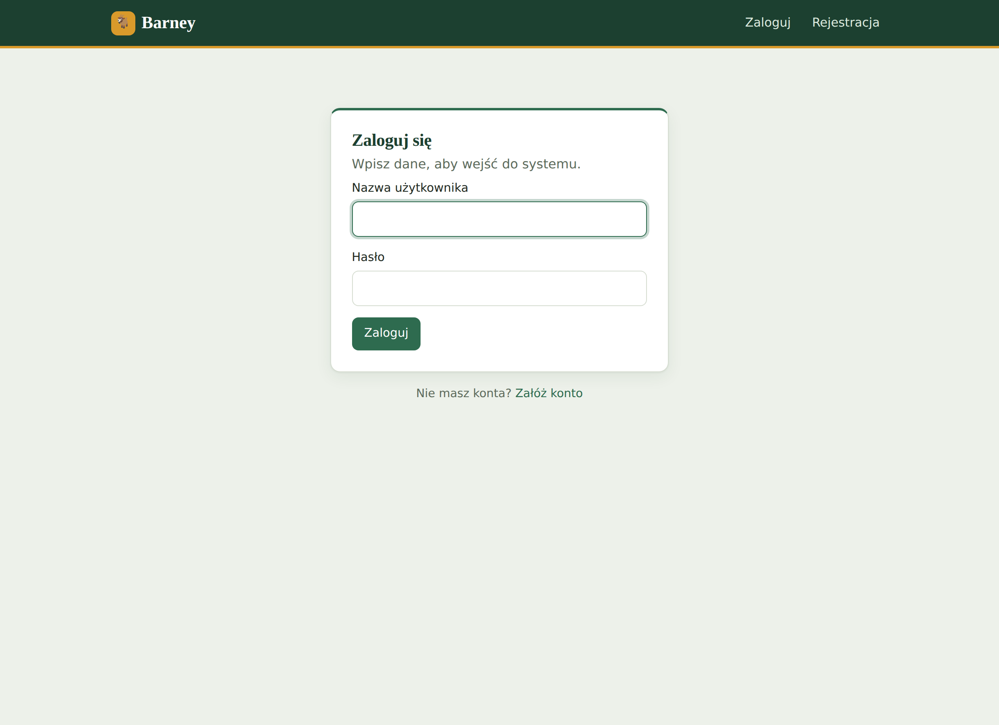

- **Ekran:** logowanie (`auth/login.html`).
- **Aktor:** anonimowy użytkownik.
- **Cel:** uzyskanie dostępu do systemu.
- **Akcja użytkownika:** podanie nazwy użytkownika i hasła.
- **Logika systemu:** `LoginView` uwierzytelnia, tworzy sesję, przekierowuje na stronę startową.
- **Rezultat:** zalogowany użytkownik trafia na listę zadań.
- **Przypadek użycia:** UC-01. **Komponent:** auth Django + `users`.

### 23.2. Lista zadań (strona startowa)

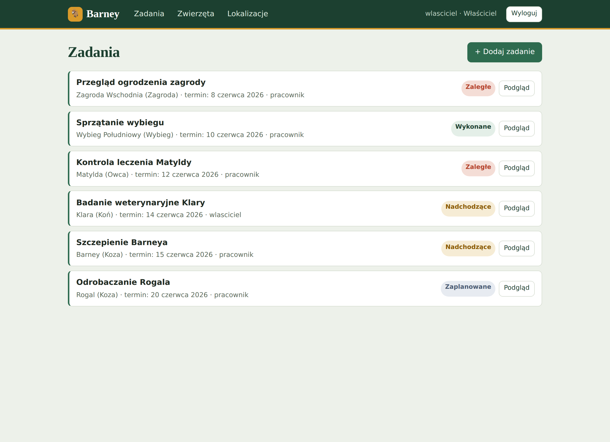

- **Ekran:** lista zadań (`tasks/task_list.html`).
- **Aktor:** Właściciel.
- **Cel:** przegląd zadań i ich terminów.
- **Co widać:** zadania z danych demo, kolorowe statusy — „Zaległe” (czerwone), „Nadchodzące” (żółte), „Zaplanowane”, „Wykonane” — liczone z terminu metodą `display_status()`.
- **Logika systemu:** `TaskListView`; dla właściciela queryset = wszystkie zadania.
- **Rezultat:** użytkownik widzi, co zaległe i nadchodzące.
- **Przypadek użycia:** UC-11 (i UC-05 analogicznie dla zwierząt). **Komponent:** `tasks`.

### 23.3. Lista zwierząt

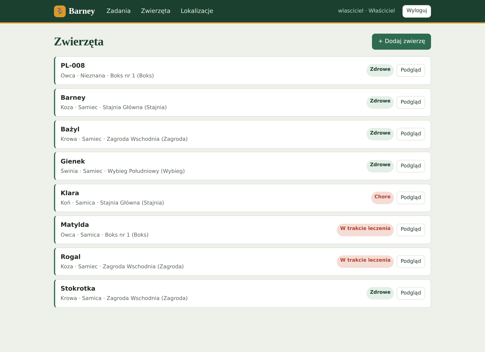

- **Ekran:** lista zwierząt (`animals/animal_list.html`).
- **Aktor:** Właściciel.
- **Cel:** przegląd ewidencji.
- **Co widać:** zwierzęta z gatunkiem, płcią, lokalizacją i statusem zdrowia (pill „Zdrowe” / inny).
- **Logika systemu:** `AnimalListView`.
- **Przypadek użycia:** UC-05. **Komponent:** `animals`.

### 23.4. Szczegóły zwierzęcia (z historią notatek i zadań)

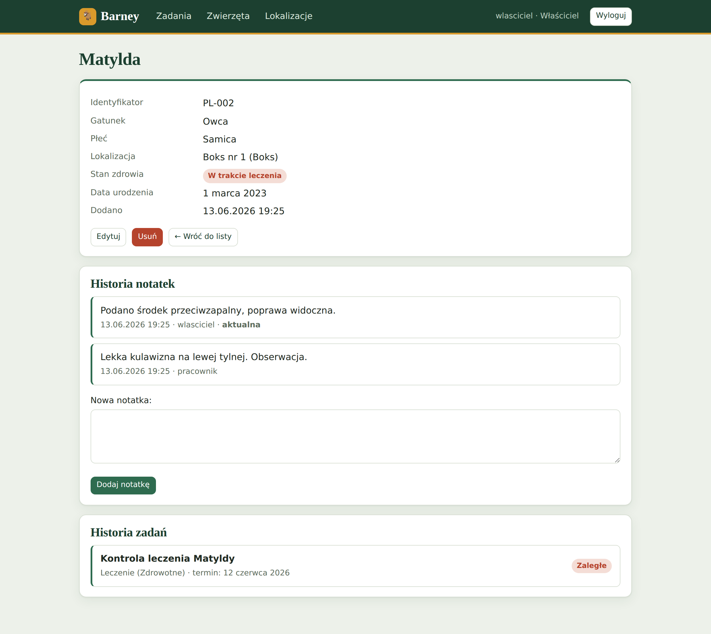

- **Ekran:** szczegóły zwierzęcia (`animals/animal_detail.html`) — tu „Matylda” (w trakcie leczenia).
- **Aktor:** Właściciel.
- **Cel:** sprawdzenie lokalizacji, stanu zdrowia, historii notatek i zadań.
- **Co widać:** dane zwierzęcia, historia notatek z autorem i datą (najnowsza „aktualna”), powiązane zadania.
- **Logika systemu:** `AnimalDetailView` + formularz notatki.
- **Przypadek użycia:** UC-06. **Komponent:** `animals`.

### 23.5. Lista lokalizacji

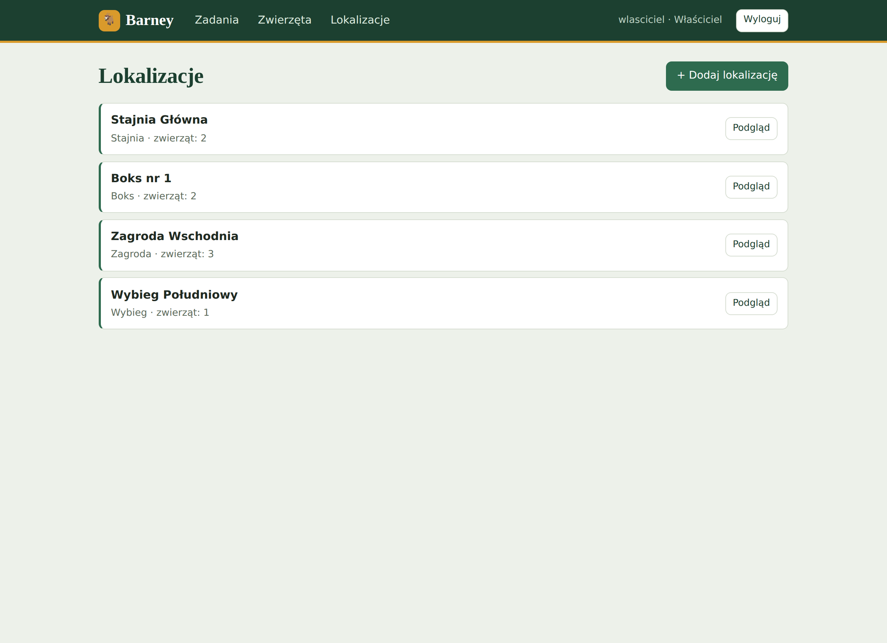

- **Ekran:** lista lokalizacji (`buildings/building_list.html`).
- **Aktor:** Właściciel.
- **Cel:** przegląd stajni, boksów, zagród, wybiegów wraz z liczbą zwierząt.
- **Logika systemu:** `BuildingListView`; liczba zwierząt z relacji `animals`.
- **Przypadek użycia:** UC-07. **Komponent:** `buildings`.

### 23.6. Szczegóły lokalizacji

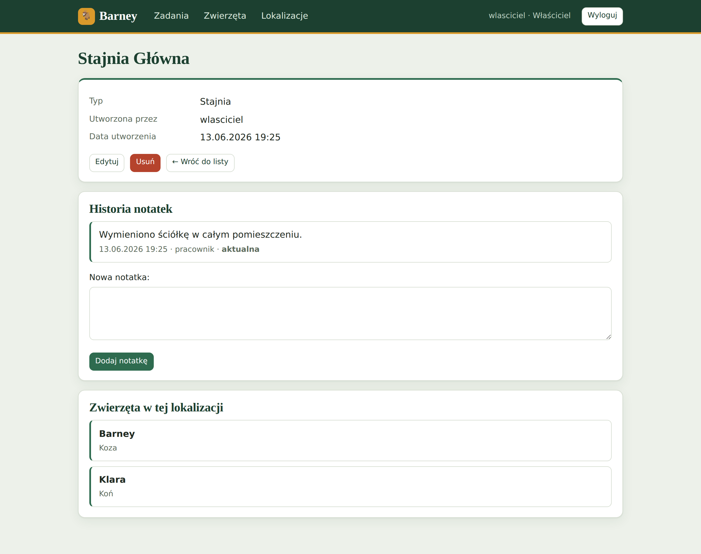

- **Ekran:** szczegóły lokalizacji (`buildings/building_detail.html`) — „Stajnia Główna”.
- **Aktor:** Właściciel.
- **Co widać:** typ, autor i data utworzenia, historia notatek, lista zwierząt w lokalizacji.
- **Logika systemu:** `BuildingDetailView` + formularz notatki.
- **Przypadek użycia:** UC-07. **Komponent:** `buildings`.

### 23.7. Formularz nowego zadania

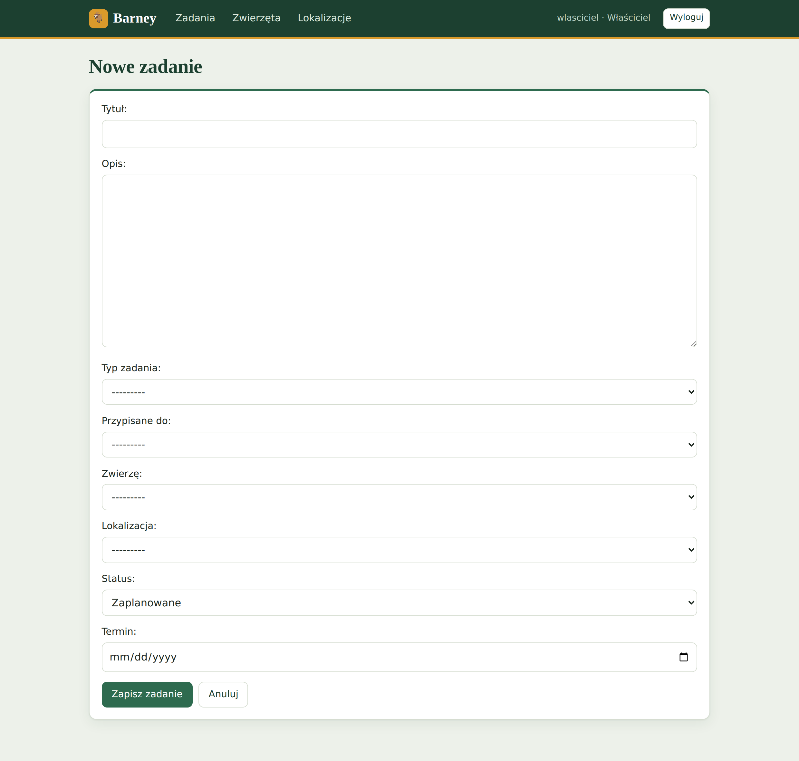

- **Ekran:** formularz zadania (`tasks/task_form.html`).
- **Aktor:** Właściciel.
- **Cel:** wprowadzenie danych nowego zadania.
- **Co użytkownik robi:** podaje tytuł, opis, typ, osobę przypisaną oraz cel (zwierzę albo lokalizacja) i termin.
- **Logika systemu:** `TaskCreateView` + `TaskForm` (walidacja celu w `clean()`).
- **Przypadek użycia:** UC-08. **Komponent:** `tasks`.

### 23.8. Szczegóły utworzonego zadania

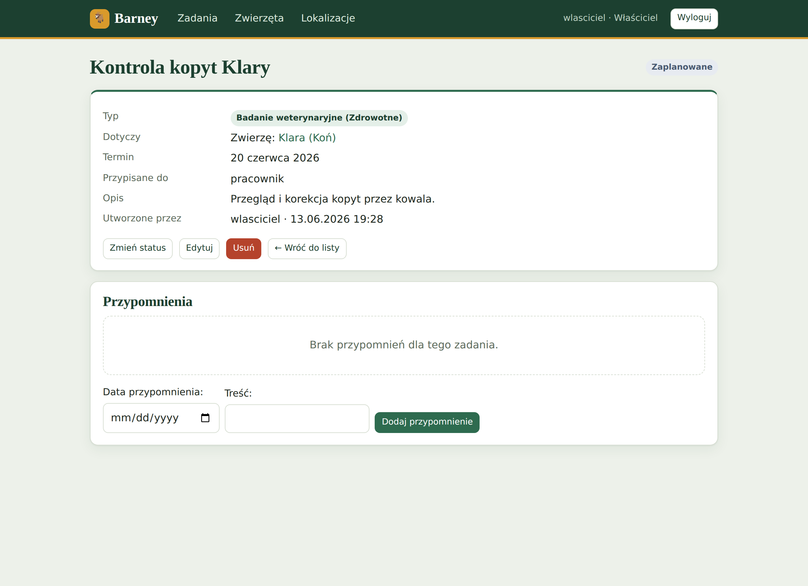

- **Ekran:** szczegóły zadania (`tasks/task_detail.html`) — „Kontrola kopyt Klary”.
- **Aktor:** Właściciel.
- **Co widać:** typ (Badanie weterynaryjne / Zdrowotne), cel (Klara), termin, osoba przypisana, autor; sekcja przypomnień (na razie pusta) z formularzem.
- **Logika systemu:** zapis zadania z `created_by`, przekierowanie na szczegóły.
- **Rezultat:** zadanie zapisane i widoczne na liście oraz na karcie zwierzęcia.
- **Przypadek użycia:** UC-08. **Komponent:** `tasks`.

### 23.9. Zadanie z dodanym przypomnieniem

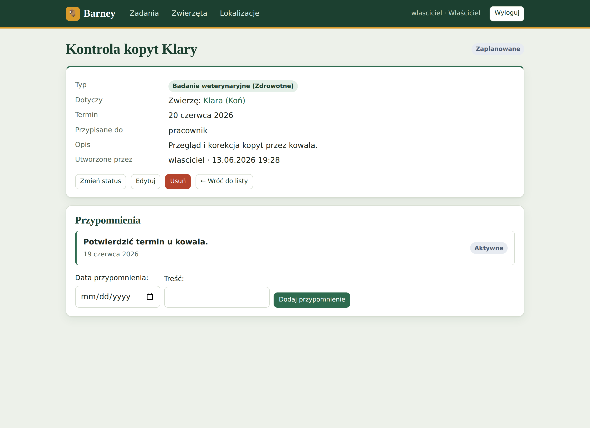

- **Ekran:** szczegóły zadania po dodaniu przypomnienia.
- **Aktor:** Właściciel.
- **Co użytkownik robi:** wprowadza datę i treść przypomnienia, zatwierdza.
- **Logika systemu:** `ReminderCreateView` zapisuje `Reminder` powiązany z zadaniem.
- **Rezultat:** przypomnienie „Potwierdzić termin u kowala.” widoczne na karcie zadania ze statusem „Aktywne”.
- **Przypadek użycia:** UC-09. **Komponent:** `tasks` (Reminder).

### 23.10. Zmiana statusu zadania

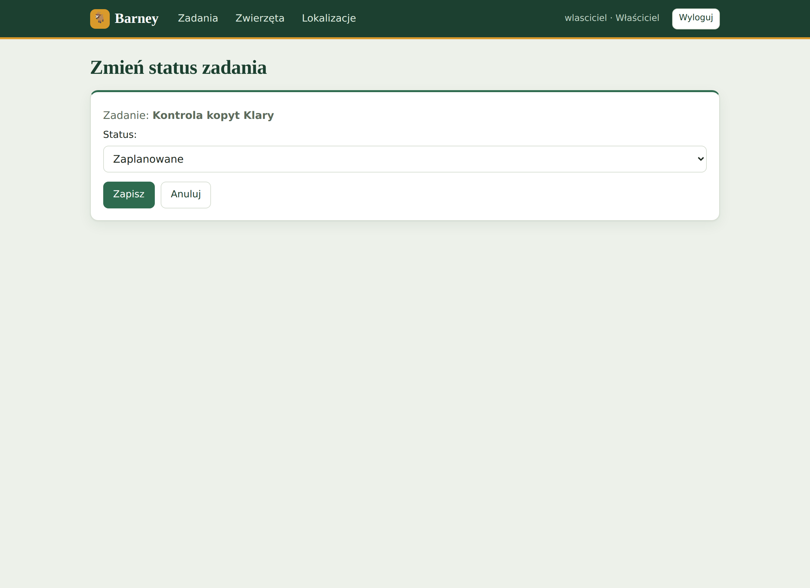

- **Ekran:** formularz statusu (`tasks/task_status_form.html`).
- **Aktor:** Pracownik (dla własnych zadań) lub Właściciel/Administrator.
- **Cel:** aktualizacja statusu (np. „Wykonane”).
- **Logika systemu:** `TaskStatusUpdateView` z querysetem ograniczonym rolą.
- **Rezultat:** nowy status; lista odświeża kolor i etykietę.
- **Przypadek użycia:** UC-10. **Komponent:** `tasks`.

### 23.11. Widok pracownika (ograniczona lista zadań)

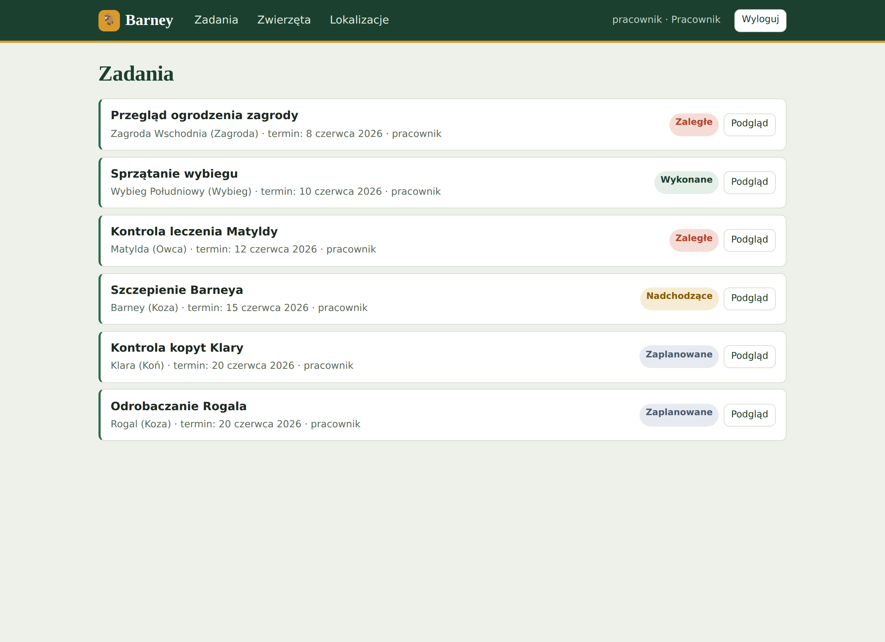

- **Ekran:** lista zadań zalogowana jako `pracownik`.
- **Aktor:** Pracownik.
- **Co widać:** **tylko** zadania przypisane do tego pracownika; brak przycisku „+ Dodaj zadanie”.
- **Logika systemu:** `TaskListView.get_queryset` filtruje po `assigned_to`; szablon ukrywa akcje tworzenia dla roli WORKER.
- **Rezultat:** potwierdzenie kontroli dostępu opartej na rolach (NFR-03 / FR-02).
- **Przypadek użycia:** UC-05/UC-11 w kontekście roli pracownika. **Komponent:** `tasks` + mixiny ról.

### 23.12. Workflow głównej funkcjonalności (kroki)

1. **Wejście do aplikacji** → ekran logowania (23.1).
2. **Logowanie** jako właściciel → przekierowanie na listę zadań (23.2).
3. **Przegląd danych** — zwierzęta i lokalizacje (23.3–23.6).
4. **Utworzenie zadania** w formularzu z walidacją celu (23.7) → szczegóły zadania (23.8).
5. **Dodanie przypomnienia** do zadania (23.9).
6. **Zmiana statusu** zadania na „Wykonane” (23.10).
7. **Weryfikacja** — statusy zaległe/nadchodzące/wykonane widoczne na liście; **kontrola ról** potwierdzona ograniczonym widokiem pracownika (23.11).

> Wszystkie zrzuty wygenerowano z realnego renderowania widoków Django na danych z `seed_demo`, więc odzwierciedlają faktyczne działanie prototypu, a nie makiety.

---

## 24. Podsumowanie

Barney realizuje cel projektu: zastępuje rozproszone notatki i arkusze jednym, spójnym modelem cyfrowym do opieki nad zwierzętami w małym gospodarstwie. Najważniejszą wartością nie jest samo przechowywanie danych, lecz powiązanie zwierząt, lokalizacji, zadań i terminów oraz uwidocznienie tego, co zaległe i nadchodzące, w podziale na role.

**Co jest gotowe (zaimplementowane):** konta i role; logowanie/rejestracja; CRUD zwierząt i lokalizacji; zadania z typami HEALTH/MANAGEMENT i walidacją celu; statusy liczone z terminu; oznaczanie statusu; przypomnienia (zapis i podgląd); historia notatek z autorem; dane demonstracyjne; 45 testów (~97% pokrycia); konteneryzacja Docker + PostgreSQL.

**Co jest częściowe:** zarządzanie kontami/rolami oraz gatunkami i typami zadań — wyłącznie przez panel administracyjny Django (brak dedykowanego UI); przypomnienia — bez realnej wysyłki powiadomień.

**Co wymaga uzupełnienia (planowane):** dashboard (UC-12); adapter i integracja z zewnętrznym systemem powiadomień (UC-13); wdrożenie produkcyjne (nginx + serwer WSGI/ASGI, wyłączenie `DEBUG`, sekrety poza repozytorium); reset hasła; testy dla nowych modułów.

**Rozbieżności prezentacja ↔ kod (świadomie udokumentowane):** brak warstwy serwisów (`services.py`) — logika w modelach/formularzach/widokach; frontend na własnym CSS zamiast Bootstrapa; testy na `django.test` zamiast pytest; brak nginx w obecnym wdrożeniu; nazwy aplikacji (`users` zamiast `accounts`, `buildings` zamiast `locations`), a `species`/`reminders` jako modele wewnątrz aplikacji, nie osobne moduły.

Architektura wynika bezpośrednio z wymagań i przypadków użycia, a wybrany stos (Django + PostgreSQL + Docker) pozwala rozwijać system w sposób uporządkowany — w pierwszej kolejności o dashboard i realne powiadomienia.
